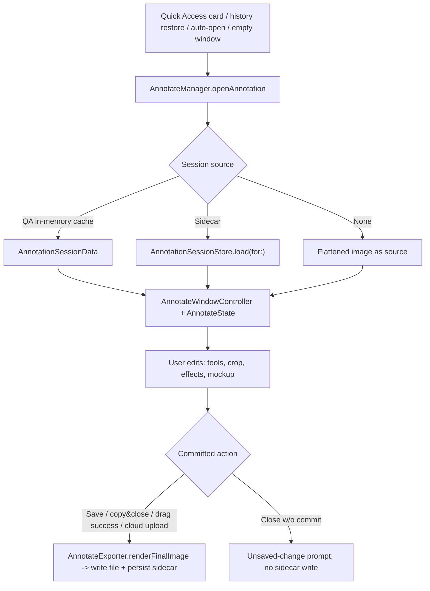
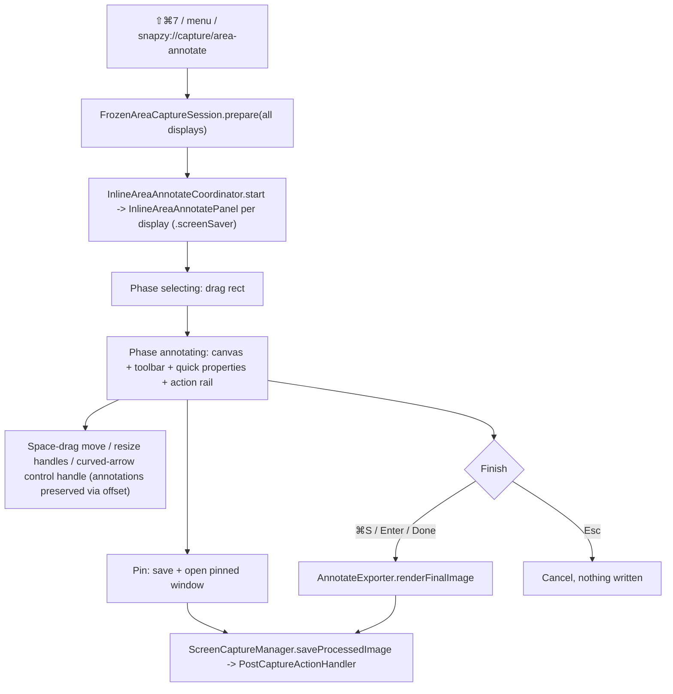

# Annotate Editor & Capture Markup

Snapzy's annotation subsystem: the full Annotate editor window (hybrid AppKit shell + SwiftUI chrome + AppKit drawing canvas) and the inline area-annotate overlay (Capture Markup) that reuses the same engine before save. Both render final output through one exporter path.

## Architecture

- `Snapzy/Features/Annotate/AnnotateManager.swift` — singleton window registry; session cache keyed by `QuickAccessItem.id`; activation policy bump to `.regular` on open; `openAnnotation(for:)` (QA item) / `openAnnotation(url:sessionData:)` / `openEmptyAnnotation()`.
- `Snapzy/Features/Annotate/Managers/AnnotateWindowController.swift` — per-window controller, owns save/copy/close notifications.
- `Snapzy/Features/Annotate/Managers/AnnotateWindow.swift` — `NSWindow` subclass; intercepts ⌘+scroll zoom, trackpad magnify, Space key (pan mode via `annotateSpaceDown/Up` notifications), drag events; level floats while key (`activeEditorLevel`) and restores `restingLevel` on resign; pin sets resting level `.floating`. `AnnotateWindowEventRouter` scopes these input notifications (and cloud-upload actions) to the originating window, so each full editor keeps isolated viewport and UI state.
- `Snapzy/Features/Annotate/AnnotateState.swift` — central `ObservableObject` (~4.8k lines): annotations, tools, undo/redo, zoom/pan, canvas effects, crop, cutout, mockup, combine, cloud state.
- Layout (`AnnotateMainView`): `AnnotateToolbarView` → `AnnotateQuickPropertiesBar` → `HStack(AnnotateSidebarView 240pt | AnnotateCanvasView)` → `AnnotateBottomBarView`.
- Rendering: `DrawingCanvasNSView` (AppKit event container) + 7 stacked `CanvasLayerView`s composited by CoreAnimation — spotlight overlay → selection underlay → static-below → dragged → static-above → gesture preview → selection chrome. Static layers redraw only when invalidated (CA reuses their backing store), so per-frame cost is flat in annotation count and colors always render through the standard pipeline (no offscreen bitmap color management). Deterministic export via `AnnotateExporter.renderFinalImage` (mockup: `renderMockupFlatImage` off-main + `compositeMockupImage` on main — `ImageRenderer` is main-only).
- Gesture handling: drag/resize/draw gestures mutate gesture-local `AnnotationItem` copies (no `@Published` churn) and commit once on `mouseUp` via the regular `AnnotateState` update methods + one undo checkpoint; the manipulated item draws in the dragged layer between the static layers (exact z-order). Invalidation: content publishers (`$annotations`, `$sourceImage`, …) redraw all layers; selection changes and zoom redraw only the cheap selection layers. Full redraw path culls items outside the dirty rect.
- Render z-order (`renderOrdered` in `AnnotateAnnotationItem.swift`, shared by canvas + exporter + hit-testing): embedded images bottom → blur/redact → markup (shapes, arrows, text, counters, …) top. Stable within tiers; model array order unchanged, so blur never covers shapes in canvas or export.
- `AnnotateState.EditorMode`: `.annotate` (flat editing), `.mockup` (3D transforms), `.preview` (hides editing UI).

### Save-and-close ordering (perf)

⌘S/close-with-save is ordered so the Quick Access card reappears with an unblocked main thread:

1. `markAsSaved` + session cache + `state.makeRenderSnapshot()` — freezes every render input into a value-type `AnnotateRenderSnapshot` (warms lazy embedded-CGImage caches, pre-resolves main-bound wallpaper/blur images).
2. Instant anti-flash thumbnail: `cacheDisplay` of the canvas region (`DrawingCanvasNSView`, no toolbar/sidebar chrome) downscaled to 200px — set on the card immediately; the pin window is NOT updated with it.
3. `forceClose()` — window hidden + closed, card reappear commits.
4. `Task.detached`: off-main `renderFinalImage(snapshot:)` → off-main 200px downscale → main push of the authoritative thumbnail + pin full-res update + `markCloudStale` (guarded by a per-item save generation, last-save-wins) → `saveToFileOffMain` (encode off-main; scoped write + history on main) → sidecar persist off-main (`AnnotationSessionStore.persistOffMain`) → clipboard re-copy off-main (`ClipboardHelper.copyImageOffMain`, serialized).

The `.accessory` activation-policy revert is deferred to a later runloop turn (shared by Annotate/VideoEditor) so it never stalls the reappear. Signposts (`perf.signposts` default + Instruments `com.snapzy.perf`): `AnnotateReturn`, `instantThumbCapture`, `windowClose`, `render`, `thumbnailScale`. Perf evidence: `plans/260718-1956-quick-access-annotate-return-perf/reports/`.

## Tools & Shortcuts

`AnnotationToolType` (`Models/AnnotateAnnotationToolType.swift`) — 15 tools, single-key defaults, all rebindable via `AnnotateShortcutManager`:

| Tool | Key | Tool | Key | Tool | Key |
| --- | --- | --- | --- | --- | --- |
| selection | `v` | arrow | `a` | blur | `b` |
| crop | `c` | line | `l` | spotlight | `s` |
| rectangle | `r` | text | `t` | counter | `n` |
| filledRectangle | `f` | highlighter | `h` | watermark | `w` |
| oval | `o` | pencil | `p` | mockup | `m` |

- `drawableTools` shared with inline overlay so surfaces stay in sync; `supportsQuickPropertiesBar` false for selection/crop/mockup.
- While a drawing tool is active, a drag can start over an existing annotation to create a new item; use Selection to move or resize existing annotations.
- In the full annotation window, `⌘C` copies selected annotation items to the session-local editable clipboard, `⌘V` pastes independent items centered under the canvas cursor when available, and `⌘D` duplicates the selection. Repeated pastes add a predictable 10pt diagonal offset; duplicated items use the same fixed offset (all clamped to the editable canvas when possible). Each operation is one annotation undo/redo checkpoint. Text editors and input fields keep native copy/paste behavior, and the inline overlay keeps `⌘C` for copying the rendered image.
- Annotate sessions — both the inline screenshot overlay and full editor windows (`AnnotateWindowController`) — start with `annotate.defaultTool` (selection by default). When `annotate.rememberLastTool` is enabled, explicit toolbar or keyboard tool choices on either surface are stored in `annotate.lastUsedTool` and take precedence in the next session. Combine-mode activation and annotation-selection tool switches still force Selection and are never remembered.
- Quick properties bar (`AnnotateQuickPropertiesBar`): context controls — primary color, text background, blur type, arrow style/bend/heads, watermark text/style/opacity/rotation, stroke width, font size, corner radius, line style, highlighter text snapping. Modes `hidden / toolDefaults / selectedItem`.
- Line style (`LineDashStyle` = solid / dashed / dotted): applies to rectangle, filledRectangle stroke, oval, line, and classic arrows (shaft dashed, heads stay solid; tapered/outlined arrows are filled silhouettes and don't qualify). Dash lengths scale with stroke width; dotted = zero-length segments + round caps. Persisted per tool and in session sidecars as optional `lineStyle` raw strings (default `.solid`, no schema bump).
- Hold Shift while drawing Rectangle, Filled Rectangle, or Oval to lock equal width and height; Line and Straight Arrow snap to 45-degree increments, while Curved Arrow remains unconstrained.
- "Sync tool defaults" pref (`annotate.quickPropertiesSyncEnabled`, default on): tool defaults (color, stroke width, font size, corner radius, watermark opacity/rotation) shared across compatible tools via `SharedAnnotationParameterDefaults` (`annotate.parameterDefaults.v1`) when nothing selected; per-tool defaults stay independent when off (`annotate.toolParameterDefaults.v1`). Selected-item numeric edits stay local; slider drags grouped into one undo checkpoint.
- Favorite colors capped at 4 per role (`AnnotateColorPaletteStore.maximumFavoriteColorCount`; custom colors cap 24).

## Arrows

- `ArrowGeometry` (`Models/AnnotateAnnotationItem.swift`): `ArrowStyle` = straight / curvedRight / curvedLeft; `ArrowType` = classic / tapered / outlined.
- Double-sided heads: `ArrowEndpointStyle` `startHead` / `endHead` (commit `b299bad`); applies to `.classic` — tapered/outlined bake the head into the body.
- Figma-style endpoint dragging for arrows + lines (commit `22766cb`).
- Curved arrows expose an external Bezier control-point handle while a single arrow is selected with the Selection tool. Dashed guides connect the handle to both endpoints; dragging it changes curvature without moving endpoints, clamps to the active drawing bounds, and synchronizes `curvedLeft` / `curvedRight` when it crosses the endpoint chord. Endpoint drags preserve the curve's normalized shape, straight arrows expose no control handle, and the existing persisted `controlPoint` field requires no schema migration.

## Text Annotations

`TextPresentation` (`Models/AnnotateAnnotationItem.swift`) gives a text annotation three shapes:

| Mode | Renders as | Stored characteristic |
| --- | --- | --- |
| `plain` | Text on the image, no container | — |
| `label` | Rounded rectangle around the text | `fillColor` (optional), outline |
| `callout` | Rounded rectangle plus an arrow tail | `calloutTailTarget` (image coordinates) |

- **Mode is independent of the fill.** Setting a label or callout background to transparent no longer collapses the item to `plain`: the outline is switched on with usable defaults (`isBorderEnabled`, black border, width 2 when unset) so the container stays visible, and a callout keeps its tail. A compact toast ("Background cleared", ~2s) confirms the change. The toolbar presentation control keeps showing the item's actual mode.
- **The mode/fill relationship is two-way.** The rule above covers "background removed while the container stays"; the converse also holds: picking a non-transparent background while in `.plain` silently promotes the item to `.label`, because only the two container modes have a background to show. The user should not have to press the style button first and then come back to the colour picker.
- **Switching modes preserves the container.** `.plain` is a rendering mode, not a property wipe — `fillColor`, `textBorderColor`, and `textBorderWidth` are kept, so Text → Text Label → Text round-trips without losing a colour the user picked. `.plain` still draws no bubble; the renderer and the edit overlay both gate on `textPresentation`.
- **In `.plain` the swatches read "无" — the stored colour is not shown.** The renderer gates the fill *and* the border on `textPresentation != .plain`, so in `.plain` neither is drawn and the fill and border swatches both render the empty-slot glyph ("无"), exactly as they do for a genuinely clear colour. The colour is still stored — the popover keeps the real bindings, so opening it still shows which colour is parked and cancelling a custom-colour draft cannot write "clear" over it — but nothing on the bar implies the user is looking at a visible surface. This is display only; picking a colour in `.plain` still promotes the item to `.label` (see the two-way rule above).
- **Switching to `plain` protects readability.** Removing the container exposes the screenshot under the text, so the text color is checked against the average color of the screenshot region behind the annotation's bounds (WCAG relative-luminance ratio, minimum 4.5:1). When it fails, the color is replaced with black or white — whichever contrasts more — and a toast ("Text color adjusted for readability", ~2.5s) reports it. A color that already passes is left untouched.
- **The readability substitution is a loan, not an edit.** The color it displaces is parked in `latentTextColor` (also persisted), so leaving `.plain` for `label` or `callout` puts the user's own color back together with the surface it was picked for — white text on a red fill goes back to white on red, not the black the contrast check chose for the bare screenshot. The parked color is dropped the moment the user picks a text color themselves, so an explicit choice always wins over the loan's repayment. Both directions re-derive from the item's current `strokeColor`, so Text → Text Label → Text round-trips without drift.
- **A font-family change re-measures the bubble, same as a size change.** `fontSize` and `fontName` both change glyph widths and so both can change where the text wraps; `updateAnnotationProperties` runs the same `reflowTextAnnotation` for either, re-deriving `bounds` from the new metrics and re-aiming an attached callout tail relative to the new bubble. Without this the text wrapped to a new height inside a bubble still sized for the old wrap, and the label clipped. Both branches share the helper precisely so a future style edit cannot pick up one without the other.
- **Corner radius is one absolute value.** Text Label and Callout Label resolve the same stored `cornerRadius` through `TextBubbleGeometry.resolvedCornerRadius(storedValue:in:fontSize:)`, so the same number gives the same curvature in both modes — and the tail-less branch of `bubblePath` passes that radius straight to `CGPath(roundedRect:cornerWidth:cornerHeight:)`, whose `cornerWidth` is the radius itself, matching every other rounded shape in the app. `0` is square and any value at or above half the bubble's shorter side renders a full pill. `fontSize` is accepted only to keep call sites uniform.
- **The tail always grows out of the outline.** `TextBubbleGeometry.calloutTail(in:requestedTarget:cornerRadius:fontSize:)` is the single decision point for where the tail is rooted, and both `bubblePath` and `tailPath` read it, so the drawn outline and the hit-test outline cannot disagree. It resolves the tip, picks the side, then:
  - **Straight span first.** The root sits on the chosen side's straight span, pulled in by `radius + maxRootHalfWidth` so it can never spill into a corner, whatever the tail's length.
  - **Corner arc when it does not fit.** On a side whose straight span is shorter than the narrowest root (a corner radius at or above roughly half the edge), the root moves onto the corner arc nearest the target: entry and exit are the two arc points `±Δ` from the anchor, with `Δ = asin(rootHalfWidth / radius)`, so the chord between them is exactly `2 × rootHalfWidth` and the tail replaces precisely that slice of arc. The corner is then drawn as `arc(start → entry)` + tail + `arc(exit → end)` — one continuous loop, which matters because the renderer fills **and** strokes the same path. The bubble's own radius is never changed.
  - **The mode is decided from the radius and the side length alone**, never from the target or the tail's length, so a drag cannot flip the root between the span and the arc and back.
- **A long tail gets shorter and blunter, not sharper.** `resolvedTailTarget` clamps the reach to `[max(12, min(shortestSide × 0.35, fontSize × 0.9)), min(shortestSide × 0.6, fontSize × 2.4)]` and the drawn root widens with length as `clamp(length × tan 26°, baseHalfWidth, maxRootHalfWidth)`, so the tip angle stays near 52° instead of collapsing to the ~14° needle it used to. Reach is capped by the shorter side, so a distant target becomes a direction indicator rather than an arm; past the cap the tip stops moving and only the direction changes. The tail also leans away from the wall's outward normal by at most `maxTailTilt` (32°), applied as a projection so dragging across the limit cannot snap it: without that cap a target dragged well past a side leaves the root clamped behind it, the tail sets off almost in the wall's own plane, and the tip ends up nearly collinear with its own root, which flattens the wedge to a sliver however blunt the length rule made it. Across the full sweep — straight out at every length, and sideways past every side and corner, at radius 0, a quarter of the short side, and half of it (a full pill) — the tip angle measures between **43° and 59°**, hitting the 52° design figure on a straight span and bottoming out where a corner arc hosts the whole root.
- **Resolving the tail is a fixed point.** `resolvedTailTarget` is one `clamp` and no longer a damped extension, so resolving an already-resolved target cannot shorten it. This is why changing the font size, applying a style preset, or switching presentation no longer eats a placed tail a little each time. The resolver is deliberately radius-free — it is what gets stored, so folding the presentation-dependent radius in would re-aim the tail whenever the radius changed; the radius only enters at draw time, which is why the drawn tail can be marginally shorter than the stored length.
- **One set of insets for all three modes.** `TextBubbleGeometry.contentInsets(for:fontSize:)` returns `max(12, min(fontSize × 0.70, 24))` horizontally and `max(7, min(fontSize × 0.45, 14))` vertically, independent of `textPresentation`. Because `bounds`, `textRect`, `textEditorInset`, and both renderers all derive from it, switching modes cannot resize the annotation or re-wrap the text. That is what makes the mode buttons feel like a style toggle rather than a re-layout.
- **Factory default is Text Label with red text.** A fresh install's Text tool starts as `.label` with a white fill, radius 10, and red text — a visible label out of the box instead of an empty frame the user has to configure. This is only the factory value; a persisted tool default (see "Presentation is sticky") always wins, so existing users keep whatever mode and colour they last used.
- **Hovering a saved style previews it.** Each preset button in the quick-properties bar and the inline toolbar floats `TextStylePresetPreviewCard` on hover: the style drawn from its own stored properties — fill, border, curvature, face, size, and a callout tail when the preset has one — over a sample string. The card reuses `TextBubbleShape` and `TextBubbleGeometry`, so the preview and the canvas agree by construction. It does not take hit testing, so moving the pointer onto it does not dismiss it; the plain `.help(name)` tooltip stays as a fallback.
- **Presentation is sticky.** `textPresentation` is part of `PersistedAnnotationProperties`, so the last mode used with the Text tool is the default for the next session's new annotations (`annotate.toolParameterDefaults.v1`). This is the tool-defaults path only — already-created annotations keep their own mode in the session sidecar.
- **Style presets: 3 system + 2 custom.** The system presets (Comment, Highlight, Callout) ship with Snapzy, are always listed, and cannot be deleted. The two custom slots are user-saved and deletable; when both are full, saving asks which slot to replace instead of silently dropping one. Applying a preset copies style only — text content, position, and an already-placed callout tail are preserved. Stored under `annotate.savedTextStylePresets.v1`; older three-slot saves migrate into the two custom slots (newest kept first).
- **The Text tool yields to a label it is hovering.** `DrawingCanvasNSView.shouldPrioritizeCanvasMarkup(over:selectedTool:)` normally lets a drawing tool claim the press and stack a new annotation on top of the one under it, but `.text` is the exception: the hover affordance for any annotation is already the hand cursor, so a press that lands on one selects it. That is what lets you place a label, then click it again to change its colour or corner radius instead of silently getting a second label. The press on empty canvas — where the hit test finds nothing and this check is never reached — still creates. Editing remains on double-click, handled earlier in `mouseDown`, so single-click select and double-click edit do not compete.
- **A new text annotation continues the previous one.** `annotationCreationProperties(for: .text)` returns the last text annotation's own properties (sanitised) instead of the factory or tool defaults whenever the document already has one, so a run of labels placed without touching the bar keeps the same colours, fill, border, font, size, corner radius, presentation and parked `latentTextColor`. Position-free only: `calloutTailTarget` is an absolute point tied to the old bounds and is deliberately dropped. The factory path — which is where the image-relative size below lives — is reached only when the document has no text annotation yet.
- **A new callout continues the previous callout's direction.** `initialCalloutTailTarget(for:fontSize:)` remaps the previous annotation's tail into the new bounds with the same normalised mapping `reflowTextAnnotation` uses for a font change, then re-resolves it, so the tail points the way the last one did instead of snapping back to the default corner. It returns nil when there is nothing to continue (no earlier text annotation, the earlier one is not a callout, or it never had a placed tail), and `createTextAnnotation` then places the default tail via `prepareTextCalloutTail` exactly as before. `prepareTextCalloutTail` itself is unchanged — it stays the unconditional "give me a default tail" call its other callers rely on.
- **The three system style presets size themselves to the canvas.** `savedTextStylePreset(at:)` overrides a system preset's `fontSize` with `recommendedTextFontSize()` (short side × 3.4%, rounded to an even step, clamped 16…36) before sanitising, so Comment / Highlight / Callout state a look rather than a fixed 18pt — which read as tiny on a large capture and oversized on a small one. Because apply, the selected-preset highlight, the hover preview card and the tool-default write-back all read that one accessor, they cannot disagree. It also fixes the knock-on "every later annotation is 18pt" symptom: applying a preset once used to write a literal 18 into the Text tool defaults. The two custom slots keep the size the user saved.
- **Fonts: 1 system + 2 built-in + 2 custom.** `AnnotateTextLayout.fixedTextFontOptions` holds System Default, Bradley Hand, and Menlo; the "Add Font" menu lists installed families from `NSFontManager` for the two custom slots. The same full-slot overwrite prompt applies, custom fonts are deletable, and the names persist under `annotate.savedTextFontNames.v1`.
- **A style preset is exactly the pixels it changes.** `textStyleMatches` compares the fields `drawText` reads to paint a text annotation — `fontSize`, `fontName`, `cornerRadius`, `textPresentation`, `textBorderWidth`, `isBorderEnabled`, and the three colours through the palette tolerance — and `applySavedTextStylePreset` writes exactly that set, plus three deliberately non-style items: it clears `latentTextColor` (the preset states a text colour, so the plain-mode loan is settled), re-derives `bounds` from the current content, and re-aims a callout tail against the current geometry rather than the preset's. This agreement is what makes the "already selected" highlight mean "applying this changes nothing": `strokeWidth`, `opacity`, `rotationDegrees` and `lineStyle` are inert for `.text` (the outline uses `textBorderWidth`; the renderer consumes dash, alpha and rotation only in the shape, arrow and watermark branches), so they are neither compared nor copied. Adding them to the comparison would not catch a real difference — it would only make the highlight stop matching presets that look identical to the selection. (`strokeWidth` does feed `selectionBounds` padding and the hit-test tolerance, which is exactly why a preset must not quietly overwrite it.)
- **Save and highlight ask the same question.** Both go through `textStyleMatches` on sanitised properties — the stored side via `customTextStylePreset(at:)`, the annotation side via `sanitizedAnnotationProperties`. Clamping only one side would let a stored value outside the control range (`fontSize` 200, a negative `cornerRadius`) fail to match the preset that was just saved from it.
- **`.plain` has no background, however much fill it stores.** `quickTextHasBackground` answers what the annotation *retains* (a fill or a border, kept on purpose so the switch back finds it); `quickTextHasVisibleContainer` answers what is *on screen*, and it is `false` for `.plain` because the renderer and the edit overlay both gate the bubble and its border on `textPresentation`. Everything that describes a surface to the user — the "text and background are the same colour" warning in particular — reads the visible container, or it talks about a surface that is not drawn. Nothing is cleared by this: going back to `.label` / `.callout` restores the container and the warning together. The plain-text readability protection is a separate path and still runs for `.plain`, because it compares the text colour against the screenshot pixels underneath the annotation rather than against the stored fill.

## Blur / Pixelate

- `BlurType` — 8 effects: pixelated, gaussian, hexagonal, crystallized, pointillism, halftone, tape, washi.
- `AnnotateBlurEffectRenderer` — CoreImage/Metal rendering with quality tiers.
- `AnnotateBlurCacheManager` — non-blocking preview cache: miss draws lightweight placeholder, background work coalesced per annotation. Budgets: 1.6 MP per blur (`maxCachedPixelsPerBlur = 1_600_000`), 8 MP total (`maxTotalCachedPixels = 8_000_000`). Save/copy/share/export bypass the cache and render deterministically through `AnnotateExporter`.

## Spotlight

- `AnnotateSpotlightCompositor` — dim-with-holes compositing via transparency layers + clear blend mode; overlapping regions union. Each spotlight can optionally draw a rectangle-style border using its stroke color, width, corner radius, and line style; the border is transparent by default and stays below regular annotations. Choosing `None` is a Spotlight-local opt-out, even when shared tool defaults are enabled.
- Single global dim opacity clamped 0.1–0.9 (default 0.5), sourced from first committed region.

## Counter, Highlighter, Watermark, Crop

- Counter: click-to-place, auto-increment per placement; diameter derived from stroke width.
- Highlighter: freehand with auto-straighten for near-straight strokes.
- Highlighter text snapping: while dragging, the stroke snaps to detected text lines — centered on each line, height `1.15 ×` the median detected line height of the drag (uniform across a multi-line sweep, carried by `strokeWidth` since highlights render at 3× stroke width), ends snapped to word edges. A drag across several lines of one block emits one bar per line with text-selection semantics in a single undo step. `AnnotateTextSnapDetector` (one Vision pass per image, computed when the highlighter is first activated, cached on `AnnotateState.textLineProfile`) feeds the pure math in `AnnotateTextSnapping`. Toggle in the highlighter's quick-properties bar (defaults context only — a committed highlight's geometry is fixed) or Settings → Annotate (`annotate.highlighterTextSnappingEnabled`, default on); hold ⌘ mid-drag to bypass. Falls back to freehand when no text is near the drag, the drag is vertical/short, or the path leaves the text band.
- Watermark: `WatermarkStyle` single / diagonal / tiled; editable text, opacity, size, rotation, color.
- Crop: shrink AND expand canvas (drag handles outside source creates annotatable empty canvas, included in export). `CropAspectRatio` presets Free/1:1/4:3/3:2/16:9/21:9 + portrait toggle. Esc cancels, Return/⌘S commits; while cropping, `CropToolbarView` replaces the bottom-bar right side.
- Crop edge snapping: while dragging resize handles in Free mode, edges snap to detected content borders (`CropContentAnalyzer` edge profile, computed once per image on crop entry). Toggle in `CropToolbarView` or Settings → Annotate (`annotate.cropSnapToEdgesEnabled`, default on); hold ⌘ mid-drag to temporarily bypass. Snapping skips fixed-aspect/Shift-locked resizes and body moves.
- Crop auto-crop to content: `A` (or the toolbar button) tightens the current crop rect to detected content borders; falls back to Vision subject-mask bounds on macOS 14+ when edge analysis finds nothing (`ForegroundCutoutService.extractForegroundResult` reuse). Toasts when nothing is detected; Esc still restores the pre-crop rect. A crop rect expanded beyond the source image tightens to the image bounds on the out-of-bounds side(s).

## Undo/Redo

- `UndoEntry` = `.annotations(AnnotationSnapshot)` | `.rotation(RotationSnapshot)` — rotation undo never disturbs the annotation path.
- Annotation snapshots include selection and embedded-layer metadata so object paste/duplicate undo is atomic and redo reselects the newly created items.
- Text-edit commits as one transaction; quick-properties slider gestures scoped to a single checkpoint (`quickPropertiesGestureUndoSnapshot`).
- **Every slider that writes through a `recordsUndo: true` binding must bracket its drag** with `setQuickPropertiesControlEditing(_:)` via the control's `onEditingChanged`. Without the bracket each tick takes its own full-document snapshot, which is both a wrong undo granularity and a re-render per frame — enough to visibly shift the bottom bar's mode buttons while a slider is dragged. `QuickCornerRadiusControl` was the one control that skipped it.

## Zoom & Pan

- Range 0.25–16x: `minimumZoomLevel 0.25`, default max 4.0, `hardMaximumZoomLevel 16.0`; `effectiveMaximumZoomLevel` grows to `1/fitScale` for very long captures.
- Input: pinch magnification, ⌘+scroll, Space+drag pan, ⌘=/⌘−/⌘0 (fit); zoom picker presets + `1:1` actual-pixels in bottom bar.
- Selection chrome is editor-only: resize/end-point grips stay 8pt, selection outlines stay 1pt with 4pt dashes, and freehand halos stay 4pt in screen space. Image-space draw geometry compensates for both fit scale and zoom while AppKit hit testing uses the matching canvas-local conversion; Retina backing density requires no separate multiplier.
- Annotation geometry remains in document/image coordinates. The fit-sized `DrawingCanvasNSView` is rendered through an outer SwiftUI zoom/pan transform; because that transform changes visual bounds without expanding the representable's AppKit hit frame, `CanvasInteractionProxy` covers the viewport and forwards only points within the canvas' transformed visual bounds (with a registered native inline text editor taking priority). The drawing view's normal AppKit conversion then inverts that transform before image-coordinate conversion applies the fit scale and canvas origin. Dynamic annotation hit tolerances and drag-to-create thresholds are derived from the combined fit scale × zoom scale, keeping lines, arrows, paths, handles, and small gestures visually aligned at every zoom level. Selection uses the canvas hit result directly instead of re-running the model's fixed image-space tolerance.
- Full-editor AppKit input is delivered through the per-window `AnnotateWindowEventRouter`; zoom, pan, and Space transitions update only the `AnnotateState` owned by the originating window. Session edits, viewport metrics, and undo state remain controller-local; shared shortcut, palette, and preset stores are preferences, not editor state.

## Backgrounds & Mockups

- `BackgroundStyle` (`Models/AnnotateBackgroundStyle.swift`): none / gradient (8 `GradientPreset`s) / wallpaper(URL) / blurred(URL) / solidColor. `BlurredBackgroundEffect`: soft / frosted / vivid / dim.
- `SystemWallpaperManager` (`Services/Wallpaper/`) — 12 bundled JPG wallpapers + custom wallpaper security-scoped bookmarks; thumbnail cache.
- Aspect ratio (`AspectRatioOption`: Auto/Free/1:1/4:3/3:2/16:9) + orientation toggle + 9-way `ImageAlignment`.
- Mockup mode: integrated 3D tilt — rotation X/Y/Z, perspective, shadow — via `AnnotateMockupTransformModifier` + `AnnotateMockup3DRenderer`; 8 `MockupPreset`s in `DefaultPresets.all` (flat, leftTilt, rightTilt, topView, isometricLeft, isometricRight, heroShot, dramatic); inline preset bar `MockupPresetBarInline`.
- Standalone `MockupManager` window (`Managers/AnnotateMockupManager.swift`) has no remaining callers — orphaned; mockup UX lives in editor mode.

## Remove Background (Cutout)

- Toolbar button, macOS 14+; `ForegroundCutoutService` (`Services/Media/`) runs Vision `VNGenerateForegroundInstanceMaskRequest`.
- Non-destructive overlay: original kept, cutout composited through `effectiveSourceImage`; revert restores original.
- Crop-aware auto-crop: `ForegroundAutoCropPolicy` heuristics → `ForegroundAutoCropDecision` enum; auto-crop applied only when `.suggested` and pref on; applied rect tracked (`cutoutAutoAppliedCropRect`) for exact revert on toggle-off.
- Global pref `backgroundCutout.autoCropEnabled` (default true), shared with capture-time cutout flow.

## Auto Sensitive-Data Redaction

- `AnnotateSensitiveRedactionService` — 100% on-device: Vision OCR → `AnnotateSensitiveDataDetector` deterministic matching. Detects emails/phone numbers/URLs (NSDataDetector), credit cards (Luhn + issuer prefixes + contextual multi-line parsing for number/expiry/cardholder rows), credential key=value pairs, Bearer/AWS/GitHub/Slack/Stripe/OpenAI/JWT tokens.
- Creates editable pixelated blur annotations in one undo checkpoint; recognized text never persisted; pixels bake only at export.
- Triggered from the blur tool's quick-properties bar; action shortcut `.autoRedactSensitiveData` ships unbound (`AnnotateShortcutManager`).

## Extract Text

In the normal Annotate mode, right-click the underlying image and choose **Extract Text**.
Snapzy runs the configured OCR provider from Capture → OCR, copies the recognized text to
the general pasteboard, and reports the result through the existing OCR notification/toast
flow. The action does not modify annotations, crop state, or saved files. It is disabled in
Combine, Mockup, and Preview modes because those modes do not identify one unambiguous OCR
source image.

## Combine Images

- `CombineImagesCoordinator` (`Features/Annotate/CombineImagesCoordinator.swift`) — picker entry from status bar menu or `snapzy://open/combine?file=...`; requires ≥2 images.
- Modes: autoStitch / freeCanvas; direction smart / horizontal / vertical; edge snapping; session persisted as `PersistedCombineSession` inside the sidecar manifest.

## Session Sidecars

- `AnnotationSessionStore` root: `~/Library/Application Support/Snapzy/AnnotationSessions/<SHA256(normalizedPath)>/`.
- Package: `manifest.json` (`PersistedAnnotationSession`, schemaVersion 1, `PersistedFileSignature` = size + modifiedAt + extension) + `original.bin` + optional `cutout.png` + `assets/` (embedded images). Signature mismatch (replaced file at same path) → sidecar ignored, never restores annotations onto wrong pixels.
- The manifest also carries `sourceLogicalSize` — the authoring-time point-space size of the source image, i.e. the coordinate space annotations live in. Session restores apply it verbatim (`AnnotateWindowController.restoredSessionImage`), so native-density (1×) captures reopen with matching annotation positions on any display arrangement; sidecars written before the field existed fall back to the legacy main-screen scale heuristic. Optional key, schemaVersion stays 1.
- File opens without a sidecar (`AnnotateState.loadImageWithCorrectScale`) derive density from the file's own DPI metadata (`fileDensityScaleFactor`, DPI ÷ 72 — Snapzy writes `scale × 72` on save); only files without usable DPI (e.g. WebP) fall back to the legacy main-screen heuristic.
- Commit-based writes only: save, save-and-close, copy&close, successful drag-to-app, cloud upload/re-upload, inline annotate finish, default-preset auto-apply. NO draft autosave; unsaved windows keep the normal unsaved-change prompt.
- Restore order: QuickAccess in-memory session cache → sidecar → flattened file.
- Cleanup paths: QA delete, Annotate delete-image, history delete, clear-history, retention sweep (incl. orphan sidecars), move-on-save (temp→export moves sidecar to new path hash).

## Drag-to-App

- `AnnotateDragHandleView` + `DragHandleNSView`: lazy `NSFilePromiseProvider` (`AnnotateDragFilePromiseProvider`) + guaranteed rendered file-URL fallback staged under `Captures/AnnotateDrag/` so file-url-only targets accept the first drag.
- `DragFallbackSignature` invalidates/renders the staged fallback when editor state changes.
- Completion policy: `annotate.closeAfterDrag` (default true — saves edits, dismisses QA card) and `annotate.bringForwardAfterDrag` (default false — reactivate preserved editor).

## Bottom Bar

- Left: zoom picker + mode segmented toggle (annotate/mockup/preview).
- **The mode toggle keeps AppKit's own fitting width.** It is a `Picker` with `.pickerStyle(.segmented)`, i.e. an `NSSegmentedControl` behind the bridge, and that control re-decides how much to compress its segments on every measurement it is handed. Two rules keep it from settling on a narrower layout and keeping it: the control carries no hard-coded `.frame(width:)` — it is sized by `.fixedSize(horizontal: true)` — and it is isolated as `AnnotateModeToggle`, an `Equatable` view comparing only the selected mode (the same treatment `AnnotateSidebarView` gets), so unrelated `@Published` changes on `AnnotateState` cannot rebuild and re-measure it. Earlier the width was pinned at 220pt, which for three icon+label segments sat right at the fitting width and left the control permanently inside AppKit's compression range.
- **The zoom chip cannot change width.** Its percent label is `.monospacedDigit()` in a fixed-width box, so `8%` and `1200%` occupy the same space. The whole left group is `.fixedSize`, so a text-driven width change would slide the mode buttons sideways as the zoom crossed 100%; it would also move `measuredLeftWidth` and with it the centred drag handle's compact threshold.
- **The quick-properties animation is scoped to the bar.** The `.animation(…, value: showsQuickPropertiesBar)` lives on `AnnotateQuickPropertiesBar` itself rather than on the root `VStack`. On the root it put the entire window — bottom bar and bridged segmented control included — inside an animation transaction every time a selection was cleared.
- Center: drag handle (compacts when tight).
- Right: new window, share (`NSSharingServicePicker`), cloud upload, pin (⌃⌘P), copy&close (⌘⇧C), delete (confirm; clears history record + sidecar + QA card, trashes file).
- Cloud button gated by `CloudManager.shared.isConfigured && QuickAccessActionConfigurationStore.shared.isEnabled(.uploadToCloud)`; ⌘U posts `annotateCloudUpload`; overwrite confirmation when item has a `cloudKey` and is stale. Note: commit `dd4ccd5` removed only the after-capture auto-upload preference — manual uploads here stay.
- Edits after upload mark item cloud-stale (`isCloudStale`) until re-upload clears it.

## Rotation & Canvas Presets

- Rotate 90° left/right from toolbar; dedicated `RotationSnapshot` undo entries.
- `AnnotateCanvasPresetStore` (`annotate.canvasPresets.v1`): background style, blur effect, spacing, shadow, corner radius, aspect ratio + orientation. One preset can be default (`annotate.defaultCanvasPresetId.v1`).
- Default preset auto-applies to new screenshots during post-capture via `ScreenshotPresetAutoApplier` — lightweight `AnnotateExporter.renderCanvasEffects` without constructing full `AnnotateState`, returns editable session data. Inline area annotate does NOT auto-apply.

## Inline Area Annotate (Capture Markup, ⇧⌘7)

Select region and annotate before saving, inside per-display overlays sharing one desktop coordinate space. Same engine/tools as the full editor minus crop and mockup.

### Inline shortcuts

| Key | Action | Key | Action |
| --- | --- | --- | --- |
| `Enter` / `⌘S` | Finish & save | `B` | Blur |
| `⌘C` | Copy rendered image | `S` | Spotlight |
| `Esc` | Cancel | `N` | Counter |
| `Space` (hold) | Move selection | `W` | Watermark |
| `V`/`R`/`F`/`O` | Selection / Rect / Filled / Oval | `P` | Pencil |
| `A`/`L`/`T`/`H` | Arrow / Line / Text / Highlighter | | |

- `InlineAreaAnnotateSession` owns the selecting→annotating state machine; panels at `.screenSaver` level with `canJoinAllSpaces` work across Spaces.
- Move/resize refreshes the cropped source via `replaceSourceImagePreservingAnnotations(_:annotationOffset:)`; cross-display crops use `FrozenAreaCaptureSession.cropCompositeImage`.
- Action rail: Pin-to-Screen / Cancel / Done (prominent) / Copy. Pin runs the normal post-capture pipeline once, then opens the saved image in a pin window.
- No crop, no mockup, no canvas-preset auto-apply.

## Related docs

- [CAPTURE.md](CAPTURE.md) — capture flows feeding the editors
- [SCROLLING_CAPTURE.md](SCROLLING_CAPTURE.md) — long captures (dynamic zoom max)
- [QUICK_ACCESS.md](QUICK_ACCESS.md) — card edit action, pin windows, session cache
- [HISTORY.md](HISTORY.md) — restore flow and sidecar lifecycle
- [POST_CAPTURE.md](POST_CAPTURE.md) — routing incl. preset auto-apply
- [CLOUD.md](CLOUD.md) — manual upload + stale/re-upload semantics
- [PREFERENCES.md](PREFERENCES.md) — Annotate settings keys
- [SHORTCUTS.md](SHORTCUTS.md) — global shortcut registry
- [LOCALIZATION.md](LOCALIZATION.md) — L10n ownership
