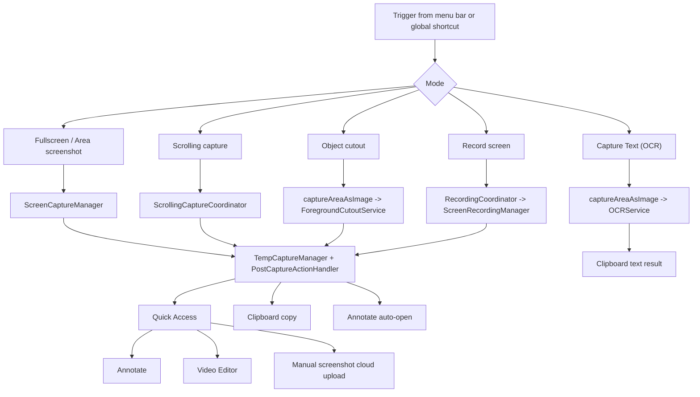
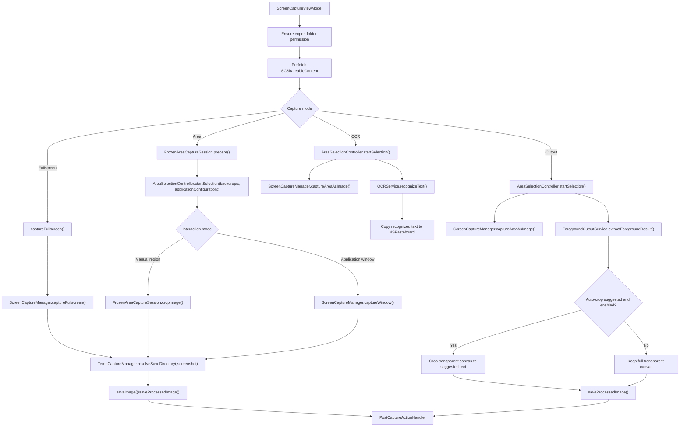
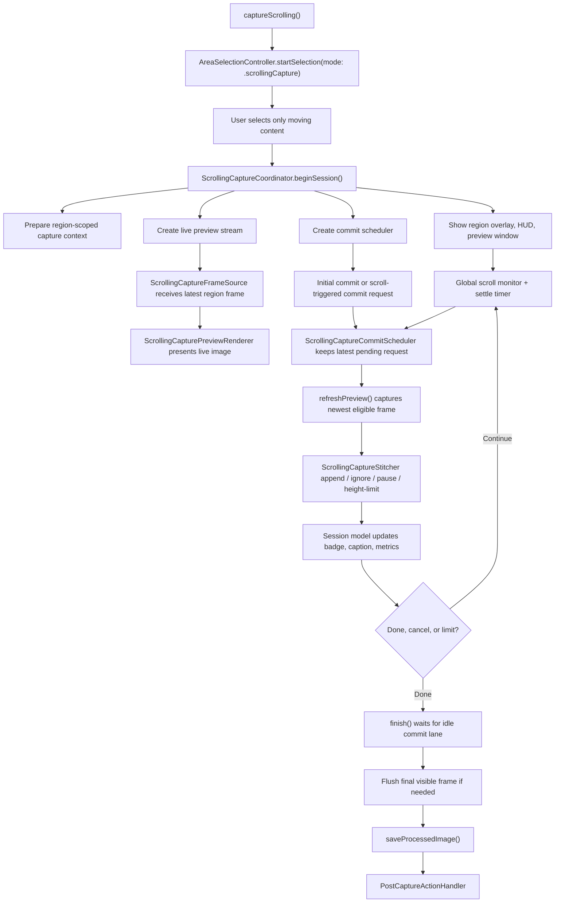
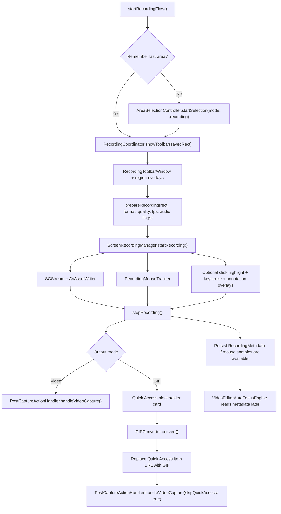
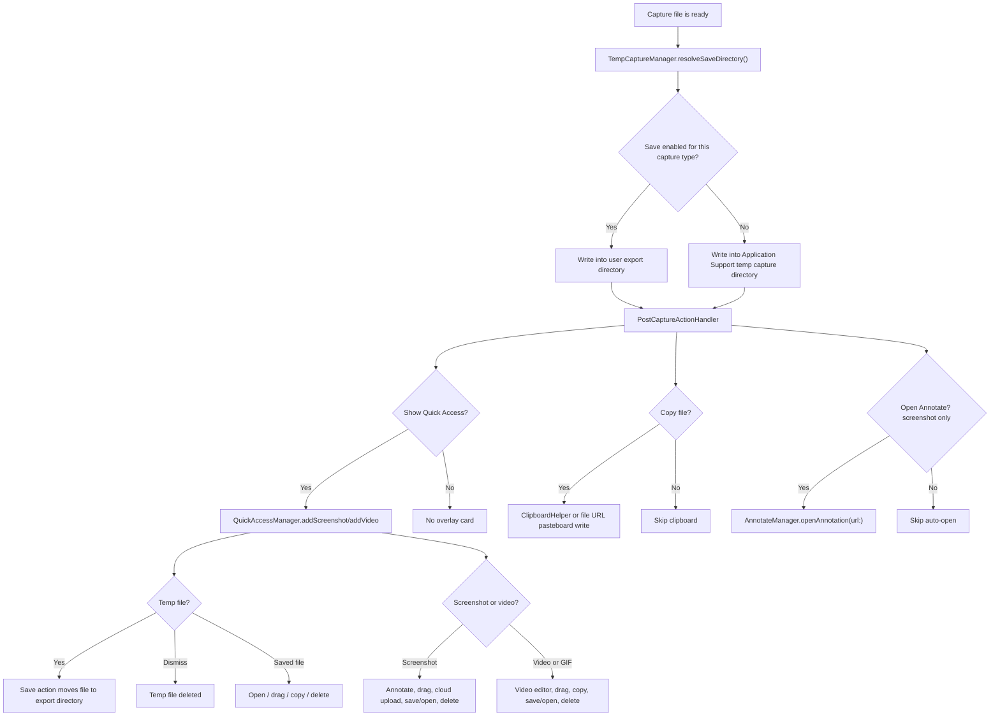
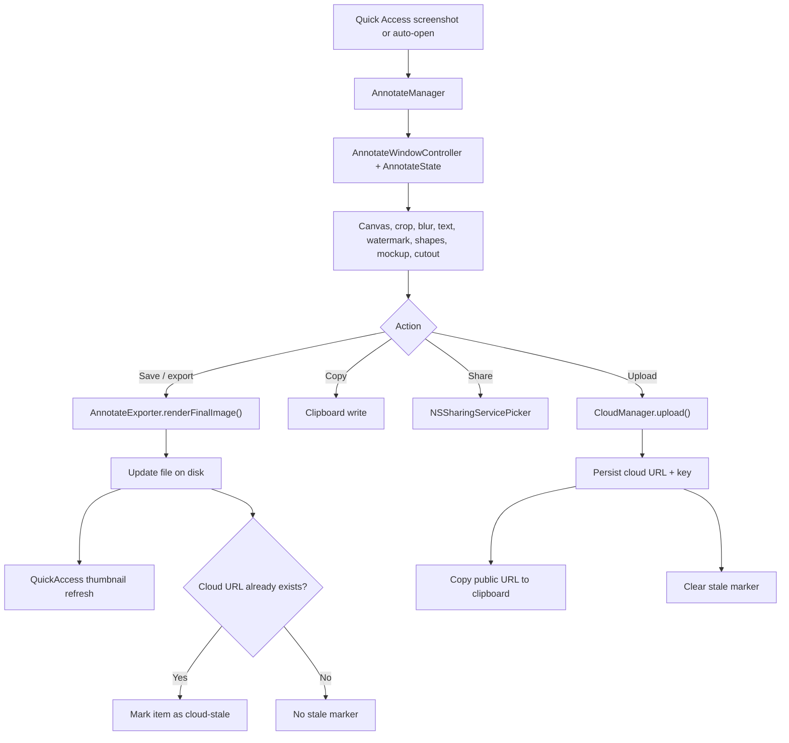
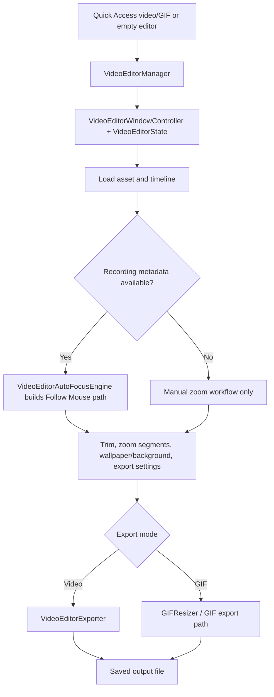

# Capture, Recording, and Editing Flows

This doc follows the runtime path from trigger to saved asset, Quick Access, editors, and cloud actions.

User-facing copy in these flows is localized through `Snapzy/Shared/Localization/L10n.swift` and `Snapzy/Resources/Localization/{Shared,Features}/*.xcstrings`. Privacy permission copy lives in `InfoPlist.strings`. For localization ownership and rules, read [`LOCALIZATION.md`](LOCALIZATION.md).

## Flow Index

## Screenshot, OCR, and Cutout

### Notes

- Fullscreen still runs directly through `ScreenCaptureManager`, but area screenshot now freezes the active display first via `FrozenAreaCaptureSession`, then either crops from that cached snapshot or switches into exact window capture for application mode.
- Non-target displays still get blocking overlay windows during area screenshot, but only the frozen display accepts the drag selection in the current implementation.
- For screenshot sessions, the target display overlay now owns direct keyboard handling for `Escape` and the application-mode toggle key, so cancel still works when Snapzy starts from a background custom shortcut without depending on Accessibility-backed global key monitoring.
- `Cmd+Shift+4` area capture now has two interaction modes inside the same overlay session: manual region by default, and application window mode toggled with the configurable `Application Capture` key from Preferences → Shortcuts. The default key is `A`.
- In application window mode, `AreaSelectionController` builds a front-to-back candidate list from `CGWindowListCopyWindowInfo` plus `SCShareableContent`, highlights the hovered window above the dimming overlay, and captures the selected app window on click without requiring a drag rectangle.
- Exact window capture is handled by `ScreenCaptureManager.captureWindow()`. macOS 14+ uses ScreenCaptureKit window metrics directly; macOS 13+ stays supported with the same ScreenCaptureKit path plus a safe area-capture fallback if exact capture fails.
- The frozen/manual and application-window paths both preserve existing desktop icon/widget exclusion, cursor, own-app exclusion, temp-save, Quick Access, clipboard, and annotate routing behavior.
- OCR is the only capture path that does not create a file; it captures a `CGImage`, runs Vision OCR, and copies text to the pasteboard.
- Object cutout is macOS 14+ only. JPEG is overridden to PNG because transparency must be preserved.
- Capture toasts, alerts, open-panel prompts, and error surfaces are localized through `L10n`.

## Scrolling Capture

### Notes

- The subsystem in `Services/Capture/ScrollingCapture/` is intentionally self-contained: preview, stitcher, HUD, metrics, commit scheduling, and window placement all live there.
- The preview lane and commit lane are separate. Live preview can stay ahead while the stitcher locks the next safe frame.
- Vision is a recovery tool inside `ScrollingCaptureStitcher`, not the default hot path.
- Session guidance, runtime badges, preview captions, and recovery toasts are localized and should stay in sync with `docs/LOCALIZATION.md`.

## Recording, GIF Output, and Smart Camera

### Notes

- Recording metadata is stored separately from the media file and powers Smart Camera / Follow Mouse in the video editor.
- GIF output is a two-step flow: record video first, then convert and swap the Quick Access item.
- `RecordingCoordinator` owns toolbar and overlay UX. `ScreenRecordingManager` owns media capture, timing, and metadata persistence.
- `AppStatusBarController` stays menu-first during active recording. The menu bar item keeps Snapzy's normal identity, shows the live elapsed time, and exposes stop plus pause/resume from the menu instead of left-click-to-stop.
- Opening Preferences from the menu bar during recording keeps Settings reachable without forcing a stop. When own-app capture is enabled, the active recording stream dynamically excludes that Settings window.
- Recording toolbar labels, output mode copy, microphone/save-folder alerts, and export errors are localized.

## Post-Capture Routing

### Notes

- `AfterCaptureAction.save` is not a post-write callback. It changes the destination before the file is written.
- Current cloud behavior is manual from Quick Access or Annotate for screenshots. The preference toggle enables those affordances; it does not auto-upload in `PostCaptureActionHandler`.
- Temp captures are intentionally stored in Application Support, not `/tmp`, so drag-and-drop remains stable.
- Quick Access action labels and post-capture error states are localized.

## Annotate and Cloud Re-Upload

### Notes

- Annotate windows cache session state per Quick Access item so the user can reopen the same card and keep editing.
- Watermark annotations are editable items with text, style, opacity, size, rotation, and color controls; export/copy/share/upload render them through the same final image pipeline as other annotations.
- Manually opened Annotate windows from the menu bar, global shortcut, or toolbar plus button are independent, so users can work with multiple clipboard/drop sessions side by side.
- If a screenshot was already uploaded, later edits mark the cloud state stale until the user re-uploads.
- Annotate dialogs, preset actions, mockup labels, cutout/export alerts, and cloud re-upload messaging are localized.

## Video Editor

## Key Files

| File | Responsibility |
| --- | --- |
| `Snapzy/Shared/Localization/L10n.swift` | Shared localization bridge for these flows |
| `Snapzy/Resources/Localization/{Shared,Features}/*.xcstrings` | Split runtime String Catalogs backing translated flow copy |
| `Snapzy/Features/Capture/CaptureViewModel.swift` | Entry point for screenshot, scrolling capture, OCR, cutout, and recording launch |
| `Snapzy/Services/Capture/ScreenCaptureManager.swift` | Core screenshot engine, frozen snapshot capture, and file writing |
| `Snapzy/Services/Capture/FrozenAreaCaptureSession.swift` | Frozen display snapshots used by area screenshot selection |
| `Snapzy/Services/Capture/PostCaptureActionHandler.swift` | Quick Access, clipboard, and screenshot auto-open routing |
| `Snapzy/Services/Capture/TempCaptureManager.swift` | Save-vs-temp destination logic and temp capture lifecycle |
| `Snapzy/Services/Capture/ScrollingCapture/ScrollingCaptureCoordinator.swift` | Long screenshot session orchestration |
| `Snapzy/Services/Capture/ScrollingCapture/ScrollingCaptureStitcher.swift` | Stitching and Vision-assisted recovery |
| `Snapzy/Features/Recording/RecordingCoordinator.swift` | Recording toolbar, overlays, stop/GIF handoff |
| `Snapzy/Services/Capture/ScreenRecordingManager.swift` | Screen recording media pipeline and metadata persistence |
| `Snapzy/Features/QuickAccess/QuickAccessManager.swift` | Floating stack state and countdown behavior |
| `Snapzy/Features/QuickAccess/Components/QuickAccessCardView.swift` | Card-level actions including screenshot cloud upload |
| `Snapzy/Features/Annotate/AnnotateManager.swift` | Annotate window lifecycle and session caching |
| `Snapzy/Features/Annotate/Services/AnnotateExporter.swift` | Final image render/export |
| `Snapzy/Features/VideoEditor/VideoEditorManager.swift` | Video editor window lifecycle |
| `Snapzy/Features/VideoEditor/Services/VideoEditorAutoFocusEngine.swift` | Follow Mouse / Smart Camera path reconstruction |
| `Snapzy/Services/Cloud/CloudManager.swift` | Upload facade, provider creation, history persistence |
