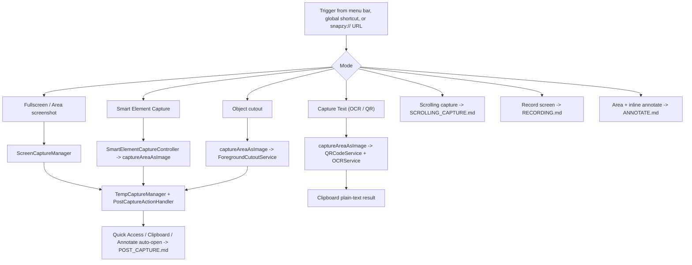
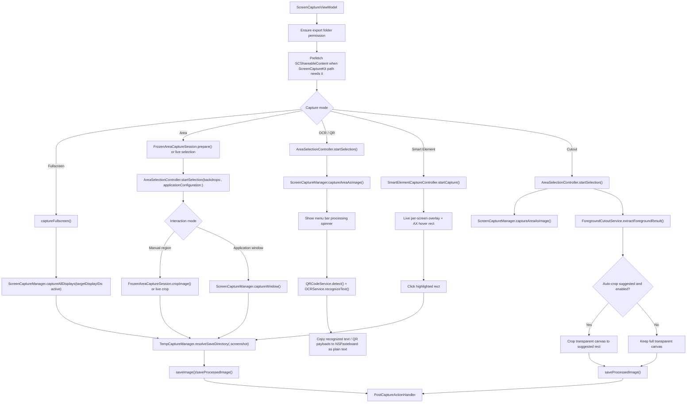

# Screenshot Capture Flows

This doc covers the screenshot capture pipeline: capture modes, the area-selection overlay, OCR/QR, object cutout, and Smart Element — from trigger to saved file. Scrolling capture, screen recording, post-capture routing, and the editors have their own docs (see Related docs).

User-facing copy in these flows is localized through `Snapzy/Shared/Localization/L10n.swift` and `Snapzy/Resources/Localization/{Shared,Features}/*.xcstrings`. Privacy permission copy lives in `InfoPlist.strings`. For localization ownership and rules, read [`LOCALIZATION.md`](LOCALIZATION.md).

## Flow Index

```mermaid
flowchart TD
    A["Trigger from menu bar, global shortcut, or snapzy:// URL"] --> B{"Mode"}

    B --> C["Fullscreen / Area screenshot"]
    B --> E["Capture Text (OCR / QR)"]
    B --> F["Smart Element Capture"]
    B --> G["Object cutout"]
    B --> D["Scrolling capture -> SCROLLING_CAPTURE.md"]
    B --> R0["Record screen -> RECORDING.md"]
    B --> IA["Area + inline annotate -> ANNOTATE.md"]

    C --> H["ScreenCaptureManager"]
    E --> J["captureAreaAsImage -> QRCodeService + OCRService"]
    F --> K["SmartElementCaptureController -> captureAreaAsImage"]
    G --> L["captureAreaAsImage -> ForegroundCutoutService"]

    H --> M["TempCaptureManager + PostCaptureActionHandler"]
    K --> M
    L --> M

    J --> N["Clipboard plain-text result"]

    M --> O["Quick Access / Clipboard / Annotate auto-open -> POST_CAPTURE.md"]
```

## Capture Modes

| Mode | Default trigger | Coordinating types | Output |
| --- | --- | --- | --- |
| Fullscreen | `⇧⌘3` | `ScreenCaptureViewModel.captureFullscreen()` → `ScreenCaptureManager.captureAllDisplays(targetDisplayIDs:)` | Image file per active display |
| Area (manual region) | `⇧⌘4` | `startAreaCapture(.manualRegion)` → `AreaSelectionController` + `FrozenAreaCaptureSession` or live path | Cropped image file |
| Application window | Menu / shortcut / `snapzy://capture/application` | Same overlay, `.applicationWindow` mode → `ScreenCaptureManager.captureWindow(target:)` | Normal window or an already open, menu-bar-anchored third-party popover; window image incl. shadow (macOS 14+) |
| Active window | Menu / shortcut / `snapzy://capture/active-window` | `ActiveWindowResolver` (AX focused window) → `captureWindow` | Window image |
| Area + inline annotate | `⇧⌘7` | `InlineAreaAnnotateCoordinator` (see [`ANNOTATE.md`](ANNOTATE.md)) | Annotated image file |
| Scrolling | `⇧⌘6` | `ScrollingCaptureCoordinator` (see [`SCROLLING_CAPTURE.md`](SCROLLING_CAPTURE.md)) | Stitched long image |
| OCR text | `⇧⌘2` | `OCRService` + `QRCodeService` | Clipboard text only (no file) |
| Object cutout | `⇧⌘1` (macOS 14+) | `ForegroundCutoutService` | Transparent PNG |
| Smart element | `⌥⇧4` | `SmartElementCaptureController` + AX services | Cropped image file |

All shortcut defaults are configurable; see [`SHORTCUTS.md`](SHORTCUTS.md). `ScreenCaptureViewModel` (`Snapzy/Features/Capture/CaptureViewModel.swift`) is the single entry point for every mode and implements `KeyboardShortcutDelegate`.

## Screenshot, OCR, and Cutout

```mermaid
flowchart TD
    A["ScreenCaptureViewModel"] --> B["Ensure export folder permission"]
    B --> C["Prefetch SCShareableContent when ScreenCaptureKit path needs it"]
    C --> D{"Capture mode"}

    D -->|Fullscreen| E["captureFullscreen()"]
    D -->|Area| F["FrozenAreaCaptureSession.prepare() or live selection"]
    D -->|OCR / QR| G["AreaSelectionController.startSelection()"]
    D -->|Smart Element| G0["SmartElementCaptureController.startCapture()"]
    D -->|Cutout| H["AreaSelectionController.startSelection()"]

    E --> I["ScreenCaptureManager.captureAllDisplays(targetDisplayIDs: active)"]
    F --> J["AreaSelectionController.startSelection(backdrops:, applicationConfiguration:)"]
    J --> K{"Interaction mode"}
    K -->|Manual region| K1["FrozenAreaCaptureSession.cropImage() or live crop"]
    K -->|Application window| K2["ScreenCaptureManager.captureWindow()"]
    G --> L["ScreenCaptureManager.captureAreaAsImage()"]
    H --> M["ScreenCaptureManager.captureAreaAsImage()"]

    I --> N["TempCaptureManager.resolveSaveDirectory(.screenshot)"]
    K1 --> N
    K2 --> N
    N --> O["saveImage()/saveProcessedImage()"]
    O --> P["PostCaptureActionHandler"]

    L --> Q0["Show menu bar processing spinner"]
    Q0 --> Q["QRCodeService.detect() + OCRService.recognizeText()"]
    Q --> R["Copy recognized text / QR payloads to NSPasteboard as plain text"]

    G0 --> G1["Live per-screen overlay + AX hover rect"]
    G1 --> G2["Click highlighted rect"]
    G2 --> N

    H --> S["ForegroundCutoutService.extractForegroundResult()"]
    S --> T{"Auto-crop suggested and enabled?"}
    T -->|Yes| U["Crop transparent canvas to suggested rect"]
    T -->|No| V["Keep full transparent canvas"]
    U --> W["saveProcessedImage()"]
    V --> W
    W --> P
```

### Fullscreen and area notes

- Fullscreen resolves the active display from `ScreenUtility.activeDisplayID()` when triggered, then runs through `ScreenCaptureManager.captureAllDisplays(targetDisplayIDs:)` so `Cmd+Shift+3` captures only the screen the user is interacting with. The hot path uses `CGDisplayCreateImage` for the target display when cursor and desktop icon/widget exclusions are off; it falls back to ScreenCaptureKit for correctness when those options are enabled.
- The fullscreen capture engine can still run without `targetDisplayIDs` for explicit all-display captures. Multi-display post-capture remains batch-aware: Quick Access and history receive every file, clipboard receives file URLs for multi-file batches, and auto-open Annotate opens only the first saved screenshot.
- Screenshot outputs use a minimum 2x pixel-density baseline. Low-density external display captures are promoted before saving so fullscreen, area, scrolling, cutout, and inline-annotated screenshots stay consistent with Retina-display output. When a selection spans Retina and non-Retina displays, the composite crop promotes and edge-enhances each low-density display slice before drawing it into the shared 2x canvas, preserving native Retina slices without re-sharpening them.
- Area screenshot has two selection modes controlled by Preferences → Capture → "Freeze area capture". Default since v1.26.0 is **live (non-frozen)**: the on-screen content keeps animating during selection and the chosen region is captured at mouse-up through `ScreenCaptureManager.captureArea(rect:)` → `makePreparedAreaCaptureContext` → `capturePreparedArea`. When the live selection spans **multiple displays**, `captureArea` detects the cross-display condition via `displayIDsIntersecting`, captures all intersecting displays in parallel using `captureDisplaySnapshotsCore`, then composites them through `FrozenAreaCaptureSession.cropCompositeImage` — reusing the frozen path's multi-display composite algorithm (DRY). Single-display selections keep the optimized single-capture path. **Frozen** is opt-in and freezes the active display first via `FrozenAreaCaptureSession`, then either crops from that cached snapshot or switches into exact window capture for application mode. Live mode uses the passthrough input architecture (click-transparent overlay driven by a `CGEventTap`) described under "Selection overlay architecture" below.
- Multi-display correctness (issue #308): for single-display selections, `makePreparedAreaCaptureContext` picks the display with the **largest intersection** area (mirroring `AreaSelectionWindow.primaryDisplayID` and the recording rule "display with the largest overlap wins"), not the first intersecting screen. For multi-display selections (≥2 displays), the composite path captures all intersecting displays and stitches them into one output image. To prevent ScreenCaptureKit from returning padded images (especially under macOS 14.2+ `.best` resolution) when the requested size exceeds the physical display bounds, config dimensions are set at the display's **native** pixel scale. `capturePreparedArea` then derives the actual scale from the returned `CGImage` dimensions and rebuilds the pixel crop in those real pixels — so HiDPI/scaled ("More Space") and mixed-DPI displays capture the correct region instead of clamping to upper-left. Low-density slices are promoted to the minimum 2× output baseline after capture; native Retina slices pass through without resampling.
- Frozen area screenshot also lazily prepares idle/hovered displays when possible. Area-selection overlay windows are excluded from screen capture, so lazy snapshots do not bake in the dim overlay or create a double-darkened backdrop. During an active cross-display drag, a newly crossed display stays live and is captured after mouse-up once the overlay has been hidden, avoiding a mid-drag freeze jump while preserving fast initial activation. Manual selection is tracked in global screen coordinates and rendered per display, so one selection rectangle can span multiple monitors.
- The live area-selection overlay has an adaptive inside-selection layer that flips between dark-on-light and light-on-dark based on the background luminance under the selection. It renders only when Preferences → Capture → "Show selection area overlay" is **off** (the standard dimming overlay path never uses it). To sample luminance, live mode captures an **invisible** backdrop (`AreaSelectionBackdrop(isVisible: false)`) via `CGWindowListCreateImage`. That capture is gated on the overlay-off state (skipped entirely by default) and runs off the main thread (`Task.detached`), because a synchronous full-screen composite blocks the run loop and lets WindowServer reset the crosshair to the arrow during overlay present / first drag.
- The live overlay is a `.nonactivatingPanel` and never becomes key (activating would dim live windows), so AppKit's cursor-rect machinery does not self-heal the crosshair after an external reset. The crosshair, key focus, and overlay windows ordering are kept sticky by re-asserting them via `NSWorkspace.activeSpaceDidChangeNotification` and `NSApplication.didBecomeActiveNotification` observers during a session, which reactivate the app, order the overlays to the front, and refresh the cursors.
- For screenshot sessions, the target display overlay now owns direct keyboard handling for `Escape` and the application-mode toggle key, so cancel still works when Snapzy starts from a background custom shortcut without depending on Accessibility-backed global key monitoring.
- `Cmd+Shift+4` area capture has two interaction modes inside the same overlay session: manual region by default, and application window mode toggled with the configurable `Application Capture` key (default `A`).
- Application-window capture can also start directly from the menu, independent shortcut, or `snapzy://capture/application`; it uses the same area capture flow with `.applicationWindow` as the initial interaction mode.
- Active-window capture resolves the AX focused window of the frontmost app via `ActiveWindowResolver`, maps it to the nearest `WindowCaptureTarget` candidate, and captures it through the same `captureWindow` path — no selection overlay appears.
- In live application window mode, Snapzy synchronously retains an already-open eligible menu-bar popover before showing any overlay. Because some transient WindowServer popovers can be enumerated but not rendered as an independent Core Graphics window, Snapzy takes one containing-display snapshot and crops the detected popover bounds from that pre-overlay image. After the overlay appears, it checks the exact `CGWindowID` during a short, bounded session-start interval: if the source closes, the retained image is restored beneath the existing dim-mask cutout; if it remains visible, no duplicate image is drawn. The retained image receives a 12pt transparent rounded-corner mask so flattened desktop pixels do not leak into exported PNG corners. The retained candidate is merged ahead of the normal front-to-back layer-0 list built from `CGWindowListCopyWindowInfo` plus `SCShareableContent`. Normal app windows keep their live behavior; only menu-bar-anchored third-party nonzero-layer popovers/dropdowns already open at capture start are retained. Snapzy, Dock, Control Center, and Notification Center are excluded.
- Exact window capture is handled by `ScreenCaptureManager.captureWindow()`. ScreenCaptureKit is preferred for every still-resolved `SCWindow`; if a retained eligible menu-bar popover is no longer shareable, Snapzy saves the pre-overlay display crop instead of recapturing after it has disappeared. The legacy Core Graphics single-window path remains only as a fallback for a live eligible popover. Snapzy does not force third-party popovers to remain open; Quick Look, ordinary in-app popovers, and dedicated macOS system UI remain out of scope.
- The frozen/manual and application-window paths both preserve existing desktop icon/widget exclusion, cursor, own-app exclusion, temp-save, Quick Access, clipboard, and annotate routing behavior.
- When own-app exclusion hides visible normal Snapzy windows for screenshot, OCR, cutout, scrolling capture, or pre-recording setup, those windows are ordered out temporarily (`HiddenWindowSession`) and restored after the capture/session finishes or is cancelled.
- Capture toasts, alerts, open-panel prompts, and error surfaces are localized through `L10n`.
- Known limitation: under macOS Accessibility Zoom (fullscreen style), screenshots capture the logical (unzoomed or top-left-anchored, version-dependent) display rather than the magnified on-screen view — no public API exposes the zoom pan offset. See "Known Limitations" in [`RECORDING.md`](RECORDING.md) (issue #423).

### Selection overlay architecture

- `AreaSelectionController` (`Snapzy/Services/Capture/AreaSelectionWindow.swift`, `@MainActor` singleton) orchestrates sessions: pooled per-display `AreaSelectionWindow` panels (`prepareWindowPool()` pre-allocates at launch for <150ms activation; pool refreshed on screen-parameter changes — mid-session, newly attached displays get configured and shown immediately so no hidden click fall-through hole appears), Escape monitors (local + global), `withDisplayOverlayHidden(Async)` for snapshot grabs while the overlay is visible, and Space/app-activation observers that trigger backdrop recapture.
- Session lifecycle is single-fire and re-entrancy safe. Starting a session while one is presenting tears the previous one down through the normal cancel path first — its completion is invoked once with `nil` (so each feature's own cancel cleanup runs: `ScreenCaptureViewModel.isAreaSelectionActive` resets, hidden windows restore, frozen sessions invalidate), its observers and Quick Access suspension are released, and the new session then starts clean. Completions are snapshotted and cleared before invocation, so a completion that synchronously calls back into the controller (live area mode calls `cancelSelection()` to dismiss) cannot fire twice. After `activatePooledWindows`, a one-shot next-run-loop assertion re-asserts `orderFrontRegardless()` for any panel WindowServer left invisible and logs it for field diagnosis.
- The dismiss policy is a `dismissesAfterSelection` start parameter (default `true`), applied after session-start teardown so it cannot be wiped by a replacement-cancel or leak across sessions; live area mode passes `false` and dismisses via `cancelSelection()` inside its completion after securing mouse-up snapshots. `setDismissesAfterSelection` remains for compatibility but new callers should use the parameter.
- `AreaSelectionWindow` is a nonactivating `NSPanel` per display with `sharingType = .none` so overlays never bake into captures; a pointer-tracking timer promotes "key-follows-pointer" keyboard ownership for non-activated live sessions. In live passthrough sessions (below) the timer stays off — Esc/arrows arrive via the event tap regardless of which window is key, and Space/application-toggle keys are passed through to the key overlay.
- **Live passthrough input** (default since the live-capture-passthrough change; Preferences → Capture → Screenshot → "Hover passthrough", `PreferencesKeys.screenshotLivePassthrough`): live (non-frozen) screenshot sessions make the overlay panels hit-transparent (`ignoresMouseEvents = true`, fully clear background — required for hover persistence: any hittable window under the pointer steals pointer ownership from the app beneath, which synthesizes tracking-exit and dismisses its hover UI) and drive the selection gesture from a global `CGEventTap` (`CaptureEventTapController` — active `.cgSessionEventTap`, head-insert, run-loop source on the main run loop). The tap **consumes every mouse event** (semantics corrected after user validation against CleanShot X, 260723): interaction with the apps beneath is frozen, so hover UI that is already visible when capture activates (tooltips, hover cards) is never dismissed by mouse-moved/exited events and persists into the captured pixels — the trade-off is that no *new* hovers trigger during the session. Observed `mouseMoved` still drives the crosshair/magnifier/coordinate indicator before it is consumed; button/drag events and Esc/arrow/Return keys are consumed and routed into the same selection state machine the window-event path uses (shared point-based handlers in `AreaSelectionOverlayView`); every other key passes through to the key overlay so Space-drag move and the application-mode toggle keep working. The tap re-enables itself on `tapDisabledByTimeout`/`tapDisabledByUserInput` (if the tap ever dies, events land on the overlay whose handlers are inert in passthrough mode — the apps beneath never see them either way), hover updates are coalesced to at most one per run-loop pass with a sub-1px hit-test guard that always processes display crossings, and signposts under subsystem = bundle id / category `CapturePassthrough` (DEBUG, `perf.signposts` default) cover the tap callback and hover update. The dim layer mirrors the legacy appearance: in manual-region mode it shows from session start when Preferences → Capture → "Show selection area overlay" is on (already-visible hover UI stays alive — the consumed events never dismiss it — but appears dimmed until the drag cutout and the final capture restore full brightness); with the preference off the dim layer is colorless and the pre-drag screen stays untouched. Window-selection mode always shows it with the hover cutout. The visible cursor is the exact legacy cursor image drawn at the pointer as a `CALayer` proxy (crosshair in manual mode, camera in window mode) for pixel-parity with the window-event path. In passthrough the real system cursor's image is never set — only the proxy renders the crosshair — so the crosshair cannot stick onto later UI (e.g. the Quick Access card) after the session now that `BackgroundCursorControl` makes background cursor changes take effect. The session hides the system cursor with `CGDisplayHideCursor` per display so only the proxy shows. Because `CGDisplayHideCursor` normally affects only the *foreground* application and Snapzy must never activate mid-capture, `BackgroundCursorControl` first grants this background agent cursor control via the private `SetsCursorInBackground` CGS connection property (resolved lazily by `dlsym`, idempotent, once per run); the hides then take effect and the system arrow disappears, leaving only the crosshair — matching the legacy window-event path. Residual edge: while the pointer is over the Dock the WindowServer keeps the Dock in cursor control, so the arrow can briefly reappear there; and if the private property is ever unavailable the hide silently no-ops and the previous arrow-visible baseline returns. Alternatives were evaluated and rejected: cursor rects require a hittable overlay (kills hover persistence), `NSCursor.hide()` only applies over our own windows, and cursor parking via disassociation + warp was rejected in user validation. Hide/show balance is tracked per display by `LivePassthroughCursorHider` so the cursor can never be left hidden where a hide did take effect, and restored in the single teardown funnel (`resetCallbacks`) on every exit path (commit, cancel, Esc, right-click, session replacement). The funnel also warps the cursor to the last pointer location the tap observed (then re-associates via `CGAssociateMouseAndMouseCursorPosition`) before showing it, because the consuming tap leaves the WindowServer's tracked cursor position stale — a plain `CGDisplayShowCursor` would otherwise reveal the arrow at the pre-session spot (a visible jump).
- Live passthrough requires Accessibility permission. Without it (or with the preference off) the session silently falls back to the legacy window-event overlay — same appearance and behavior as before, including the pointer-tracking timer; the system permission prompt is shown at most once per app run, and the preference row surfaces a "requires Accessibility permission" hint linking to System Settings.
- `AreaSelectionOverlayView` renders with CALayers: display backdrop, conditionally restored retained menu-bar popover crops, dim mask with punch-out, crosshair, size/coordinate indicators, and mode hint text. Manual drags render across displays; application-mode hover hit-tests the `WindowSelectionSnapshot.orderedCandidates` list. In live sessions, that list starts with retained menu-bar popover candidates captured at shortcut time, then merges asynchronously queried layer-0 candidates.
- Interaction modes (`AreaSelectionInteractionMode`): `.manualRegion` and `.applicationWindow`, toggled at runtime via the configurable overlay key. Results flow as `AreaSelectionResult{target: .rect|.window, displayID, mode, displayIDs, spansMultipleDisplays}`.
- `AreaSelectionMagnifier` provides a 130pt circular loupe with scroll-wheel zoom (1–20×, direction reversible in Preferences), fed only from backdrop pixels so frozen sessions magnify the snapshot.
- `WindowSelectionQueryService` also resolves the exact `SCWindow` at capture time and propagates `ownerPID` into `WindowCaptureTarget` for capture metadata (drives `{appName}` output naming).

### OCR and QR notes

- OCR is the only capture path that does not create a file; it captures a `CGImage`, shows a menu bar processing spinner (`AppStatusBarController.setProcessing`) while recognition runs, then copies text/QR payloads to the pasteboard as plain text.
- Recognition is routed by `OCRModelResolver` (from the persisted selection, `ocr.selectedModel`) to an `OCRProvider` for the active model: `VisionOCRProvider` (built-in Apple Vision, default), `PPOCRProvider` (downloaded PP-OCRv6 model running det+rec inference on ONNX Runtime), or `RemoteOCRProvider` (custom OpenAI-compatible chat-completions endpoint, base64 JPEG, 60s timeout). `OCREngine` is `vision` / `ppOCR` / `remote`.
- The built-in engine is Vision `VNRecognizeTextRequest` (`OCREngine.vision`, `.accurate` level). `OCRService` runs per-language profiles (`VisionOCRProfile`: en, vi, es, ru, fr, de, ja, ko, zh-Hans, zh-Hant, plus code/dense-document/recovery profiles), then contrast-enhanced and vertical-CJK recovery passes, picking the best candidate by confidence (diacritic-aware for Vietnamese).
- Narrow vertical CJK OCR uses a constrained recovery path inside `OCRService`: if normal Vision profiles and contrast recovery find no usable text, upright CJK glyph rows are normalized into a horizontal recovery image (`VerticalCJKTextNormalizer`) before retrying Vision. This keeps horizontal OCR unchanged while improving traditional vertical text layouts.
- Models are managed under Settings → Capture → OCR → OCR Model (see [`PREFERENCES.md`](PREFERENCES.md)). Downloadable PP-OCRv6 Tiny/Small/Medium install on demand from the official PaddleOCR repos (ONNX files from HuggingFace, dictionary from GitHub) into `Application Support/Snapzy/OCRModels/<id>/` — not bundled, so the default install size is unchanged; ONNX files are sha256-verified and downloads support progress/cancel/retry/remove. Custom endpoints (name, base URL, model identifier, optional prompt) are JSON-persisted in `ocr.customModels`; the optional API key lives in the macOS Keychain (service `com.trongduong.snapzy.ocr`) and is never exported.
- Only one model is active, and uninstalled models are not selectable. An unavailable or removed selection resolves to built-in Vision and is persisted back (`OCRModelResolver`); at launch `OCRModelStore.validateInstalledModelsOnLaunch()` additionally prunes persisted installs whose files are missing on disk and resets the selection when it referenced a pruned model. If model files disappear mid-session, the router catches `PPOCRError.modelFilesMissing`, marks the model not-installed (`OCRModelStore.markMissing`), persists built-in, and retries the recognition via Vision.
- QR detection (`QRCodeService`, `VNDetectBarcodesRequest`) runs as local Vision work alongside OCR where possible, with capture/processing duration logged for latency checks. `OCRQRPayloadComposer` merges deduped QR payloads into the clipboard text, skipping payloads already contained in the OCR text.
- QR payload handling is passive by design: Snapzy does not open decoded URLs, perform network requests, load WebViews, execute processes, or write QR payloads as file URL pasteboard items.
- Detected web links (NSDataDetector, max 3, http/https only) optionally surface in a floating clickable `OCRLinkPromptManager` panel (10s auto-dismiss) — pref `ocrLinkDetectionEnabled`, default on.
- Every OCR action reports exactly one result to the user, controlled by `ocrSuccessNotificationEnabled` (persisted key `ocr.successNotificationEnabled`, **default on**). With it on, `OCRResultNotifier` posts a native macOS notification through `SystemNotificationService` (`UserNotifications`): `Text has been copied` + a single-line preview of the recognized text (`OCRNotificationContent.preview`, 200 grapheme clusters max, whitespace collapsed, `…` suffix), `No Text Detected`, or `OCR Failed`. The clipboard always holds the full untruncated text.
- Notifications carry no sound (`content.sound = nil`) because Snapzy already plays `QuickAccessSound.complete` / `.failed`; identifiers are fresh UUIDs so consecutive captures never coalesce, and the `UNUserNotificationCenterDelegate` returns `[.banner, .list]` so the banner shows even when Snapzy is frontmost.
- Onboarding asks for notification permission up front via an optional row on the permissions step, so most users are already authorized before their first OCR. Otherwise authorization is requested lazily on the first OCR notification and at most once per launch. Explicit user actions (the onboarding row, the "Allow" button in Preferences → Capture → OCR) bypass that once-per-launch gate. When the preference is off, authorization is denied, or delivery throws, `OCRResultNotifier` falls back to the previous in-app `AppToastManager` toast — OCR itself never depends on notifications being available.

### Object cutout notes

- Object cutout is macOS 14+ only (`ForegroundCutoutService`, Vision `VNGenerateForegroundInstanceMaskRequest`, all subject instances masked on the full canvas). Fully on-device.
- Safe auto-crop: `ForegroundAutoCropPolicy` evaluates the alpha bounds (alphaThreshold 8, edge inset 2px, min subject 24px / 0.4% area, min reduction 8%, adaptive 1% padding clamped 2–16px) and returns `.suggested` or a skip reason. Applied only when Preferences keeps `backgroundCutoutAutoCropEnabled` on (default true).
- JPEG is overridden to PNG because transparency must be preserved.
- The same service powers the Annotate editor's Remove Background button; see [`ANNOTATE.md`](ANNOTATE.md).

### Smart Element notes

- Smart Element Capture is standalone. It starts from the menu, an optional user-bound global shortcut (default `Option+Shift+4`), or `snapzy://capture/smart-element`; it does not run inside the `Cmd+Shift+4` area overlay and does not freeze the desktop before hover.
- Smart Element Capture requires Accessibility permission. Startup gates through `AXIsProcessTrustedWithOptions`; without permission, Snapzy does not show the standalone overlay.
- During a Smart Element session, `SmartElementCaptureController` owns one live overlay panel per screen. `SmartElementWindowOwnerResolver` finds the topmost non-Snapzy window under the cursor, `SmartElementQueryService` uses the window PID with `AXUIElementCopyElementAtPosition`, and `AXElementInspector` normalizes AX bounds into AppKit bottom-left coordinates for highlight rendering. To ensure 60fps overlay performance, the AX queries run on a background queue with a throttle, preventing main thread blocking.
- Clicking inside the highlighted rect commits through `ScreenCaptureViewModel.captureSmartElement(rect:)`, which reuses the screenshot save and post-capture pipeline. Clicking outside the highlight or pressing `Escape` cancels without writing a capture.
- Known limitation: Chromium-based apps (Chrome, Slack, Claude desktop, Electron) may expose only `AXWebArea` for web content unless launched with `--force-renderer-accessibility` (Chromium) or `app.setAccessibilitySupportEnabled(true)` (Electron). Inside such apps the highlight may snap to the whole web view rather than individual DOM elements.

## Key Files

| File | Responsibility |
| --- | --- |
| `Snapzy/Features/Capture/CaptureViewModel.swift` | Entry point for screenshot, scrolling capture, OCR, cutout, smart element, and recording launch |
| `Snapzy/Features/Capture/OCRLinkPromptManager.swift` | Floating clickable link prompt panel after OCR |
| `Snapzy/Services/Capture/ScreenCaptureManager.swift` | Core screenshot engine, frozen snapshot capture, window capture, and file writing |
| `Snapzy/Services/Capture/AreaSelectionWindow.swift` | `AreaSelectionController`, `AreaSelectionWindow`, `AreaSelectionOverlayView` — the selection overlay stack |
| `Snapzy/Services/Capture/AreaSelectionBackdrop.swift` | Shared selection models: backdrops, `WindowCaptureTarget`, `AreaSelectionResult`, interaction modes |
| `Snapzy/Services/Capture/AreaSelectionMagnifier.swift` | Scroll-zoom pixel loupe for the selection overlay |
| `Snapzy/Services/Capture/FrozenAreaCaptureSession.swift` | Frozen display snapshots used by area screenshot selection |
| `Snapzy/Services/Capture/WindowSelectionQueryService.swift` | App-window candidate list and exact `SCWindow` resolution |
| `Snapzy/Services/Capture/ActiveWindowResolver.swift` | AX focused-window resolution for active-window capture |
| `Snapzy/Services/Capture/SmartElement/` | Standalone Smart Element overlay session, query service seams, capture performer |
| `Snapzy/Services/Capture/AXElementInspector.swift` | AX role allow/deny lists, parent-chain walk to the meaningful element, coordinate flip |
| `Snapzy/Services/Media/OCRService.swift` | OCR routing via `OCRModelResolver` + Vision orchestration: normalization, multi-profile passes, recovery paths, scoring |
| `Snapzy/Services/Media/OCR/` | `OCRProvider` engines (Vision, PP-OCR det+rec on ONNX Runtime, remote OpenAI-compatible), downloadable model catalog/store/download (`OCR/Models/`), custom endpoint persistence |
| `Snapzy/Services/Media/QRCodeService.swift` | Local QR payload detection for OCR capture |
| `Snapzy/Services/Media/ForegroundCutoutService.swift` | Vision subject-mask cutout + safe auto-crop policy |
| `Snapzy/Services/Wallpaper/DesktopIconManager.swift` | SCK content-filter exclusion to hide desktop icons/widgets at capture |
| `Snapzy/Services/Capture/TempCaptureManager.swift` | Save-vs-temp destination logic and temp capture lifecycle |
| `Snapzy/Services/Capture/PostCaptureActionHandler.swift` | After-capture action executor (see [`POST_CAPTURE.md`](POST_CAPTURE.md)) |

## Related docs

- [`SCROLLING_CAPTURE.md`](SCROLLING_CAPTURE.md) — long screenshot stitching subsystem
- [`RECORDING.md`](RECORDING.md) — screen recording, GIF output, Smart Camera metadata
- [`POST_CAPTURE.md`](POST_CAPTURE.md) — after-capture matrix, destinations, formats, clipboard
- [`ANNOTATE.md`](ANNOTATE.md) — inline area annotate (Capture Markup) and the full editor
- [`QUICK_ACCESS.md`](QUICK_ACCESS.md) — floating post-capture panel
- [`HISTORY.md`](HISTORY.md) — capture history and retention
- [`SHORTCUTS.md`](SHORTCUTS.md) — global shortcut defaults and `snapzy://` routes
- [`PREFERENCES.md`](PREFERENCES.md) — Settings → Capture reference
- [`STRUCTURE.md`](STRUCTURE.md) — source tree and runtime architecture
- [`LOCALIZATION.md`](LOCALIZATION.md) — localization ownership and rules
