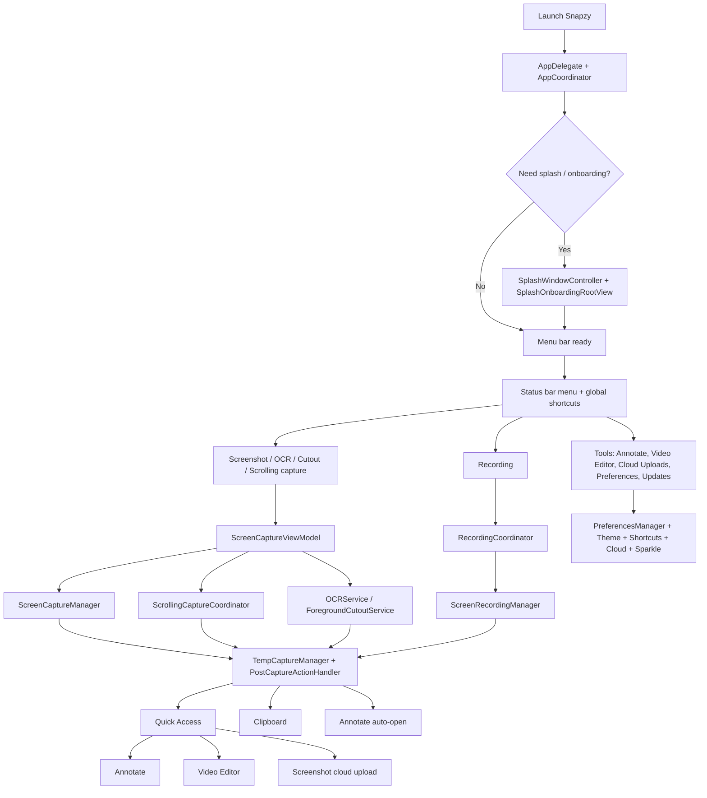

# Documentation Map

Flow-first entrypoint for humans and agents working in Snapzy.

## Read First

| Doc | Why it exists | Read when |
| --- | --- | --- |
| [`../README.md`](../README.md) | Public product summary, install, feature list | Any new session |
| [`project-structure.md`](project-structure.md) | Real source-tree map, runtime architecture, edit guide | Any code change |
| [`localization.md`](localization.md) | Localization architecture, String Catalog ownership, translation rules, verification | Copy, UI text, alerts, onboarding, preferences |
| [`capture-flow.md`](capture-flow.md) | Feature flows for capture, scrolling capture, recording, post-capture, editors | Capture, media, UX work |
| [`project-build.md`](project-build.md) | Local build and archive commands | Build, packaging |
| [`project-workflow.md`](project-workflow.md) | Release and appcast workflow | Shipping updates |
| [`local-update-testing.md`](local-update-testing.md) | Local Sparkle update test harness | Updater changes |
| [`self-signed-certificate-setup.md`](self-signed-certificate-setup.md) | Local signing setup | Update testing |

## Product Flow Map

## Agent Reading Order

- Capture, scrolling capture, recording: `project-structure.md` -> `capture-flow.md`
- Localization or user-facing copy: `project-structure.md` -> `localization.md` -> `capture-flow.md` when capture/editor UX is affected
- Onboarding, menu bar, preferences: `project-structure.md`
- Cloud storage and upload UX: `project-structure.md` + `capture-flow.md`
- Build, release, updater: `project-build.md` -> `project-workflow.md` -> `local-update-testing.md`

## Current Behavior Notes

- `AfterCaptureAction.save` decides whether captures go straight to the export folder or into `~/Library/Application Support/Snapzy/Captures/` as temp files.
- `AfterCaptureAction.uploadToCloud` currently enables screenshot cloud-upload entry points in Quick Access and Annotate. It is not executed directly by `PostCaptureActionHandler`.
- GIF recording flow first creates a video, inserts it into Quick Access, converts it, then swaps the card to the GIF output.
- Annotate and Video Editor temporarily elevate Snapzy from accessory mode to regular app mode so the editor windows appear in Dock and Cmd+Tab.

If one of these behaviors changes, update this file, [`project-structure.md`](project-structure.md), [`capture-flow.md`](capture-flow.md), and the root [`README.md`](../README.md) in the same change.
