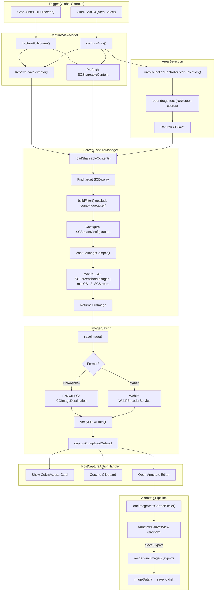

# Capture Flow

Documentation of Snapzy's screen capture pipeline — from keyboard shortcut trigger to saved file and post-capture actions.

## Architecture Overview

## Key Files

| File | Responsibility |
|------|----------------|
| `Features/Capture/CaptureViewModel.swift` | Orchestrates capture from UI. Resolves save directory, prefetches content, calls ScreenCaptureManager. |
| `Services/Capture/ScreenCaptureManager.swift` | Core capture engine. Configures SCStreamConfiguration, builds content filters, captures via SCScreenshotManager (14+) or SCStream (13). |
| `Services/Capture/PostCaptureActionHandler.swift` | Executes post-capture actions: Quick Access card, clipboard copy, open Annotate. |
| `Features/Annotate/AnnotateState.swift` | Manages annotation state. `loadImageWithCorrectScale()` loads images at correct Retina scale. |
| `Features/Annotate/Components/AnnotateCanvasView.swift` | Displays image + annotations on canvas with scale-to-fit, zoom, pan. |
| `Features/Annotate/Services/AnnotateExporter.swift` | Exports annotated images. `renderFinalImage()` combines source image + annotations + background at pixel resolution. |
| `Services/Shortcuts/SystemScreenshotShortcutManager.swift` | Detects/manages conflicts with macOS built-in screenshot shortcuts. |

## Capture Modes

### Fullscreen (`captureFullscreen`)

1. Prefetch `SCShareableContent`
2. Find target `SCDisplay` by display ID
3. Build `SCContentFilter` (display-level, excludes icons/widgets/self as configured)
4. Configure `SCStreamConfiguration`:
   - `width/height` = display pixel dimensions × `backingScaleFactor`
   - `pixelFormat` = `kCVPixelFormatType_32BGRA`
   - `captureResolution = .best` (macOS 14.2+)
5. Capture via `SCScreenshotManager` (macOS 14+) or `SCStream` single-frame (macOS 13)
6. Save via `CGImageDestination` (PNG/JPEG) or `WebPEncoderService` (WebP)

### Area Select (`captureArea`)

1. `AreaSelectionController` shows overlay → user drags selection rect
2. Find matching `NSScreen` and `SCDisplay`
3. Capture **full display** at native pixel resolution
4. **Post-capture crop** using `CGImage.cropping(to:)` with pixel-coordinate rect — avoids `sourceRect` interpolation blur
5. Save cropped image

### OCR Area (`captureAreaAsImage`)

Same as Area Select but returns `CGImage` directly for text recognition instead of saving to disk.

## Image Quality Pipeline

| Stage | Units | Key Detail |
|-------|-------|------------|
| SCStreamConfiguration `width/height` | Pixels | Set to `display.width × backingScaleFactor` |
| `captureResolution = .best` | — | Hints SCK to use optimal pixel density (macOS 14.2+) |
| `CGImage.cropping(to:)` | Pixels | Post-capture crop, no resampling |
| `CGImageDestination` save | Pixels | Direct pixel data write, no quality loss |
| `loadImageWithCorrectScale()` | Points | Sets `NSImage.size = pixelSize / scaleFactor` (preserves bitmap rep) |
| `AnnotateCanvasView` display | Points | Scale-to-fit within window using `.clipShape()` (no rasterization) |
| `renderFinalImage()` export | Pixels | Uses `NSBitmapImageRep` at `pointSize × sourceImageScale` for Retina output |

## Post-Capture Actions

Configured in user preferences, handled by `PostCaptureActionHandler`:

- **Quick Access Card** — floating overlay showing thumbnail, drag-to-app, copy/open actions
- **Copy to Clipboard** — `NSPasteboard` with image data
- **Open Annotate** — loads image into annotation editor
