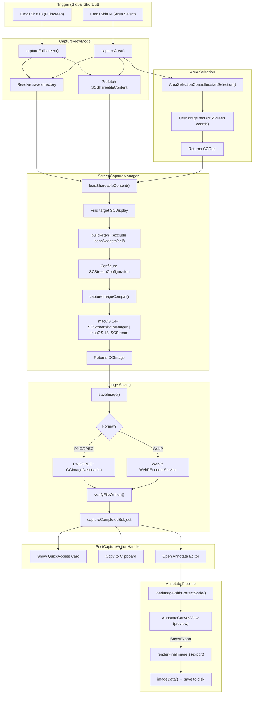
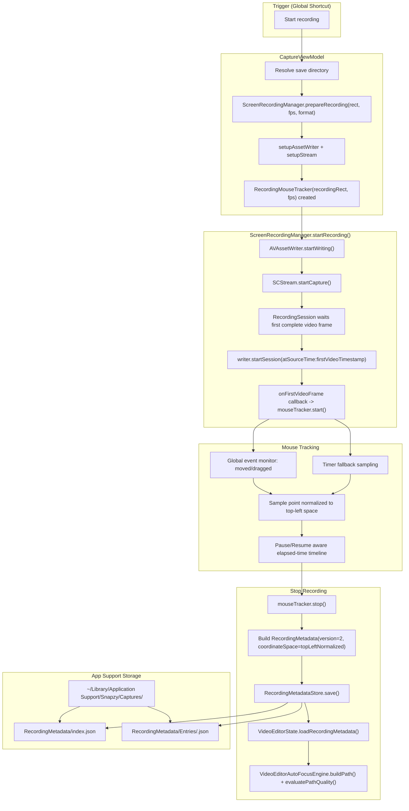
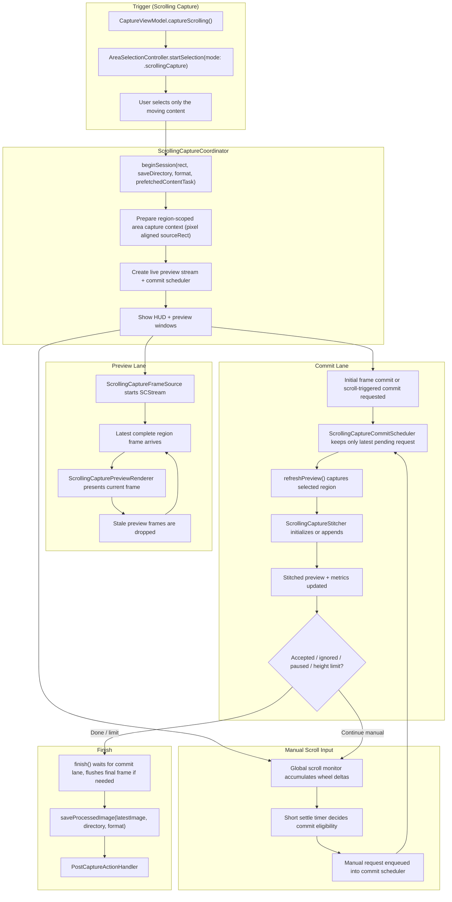

# Capture Flow

Documentation of Snapzy's screenshot + screen-recording pipelines — from keyboard shortcut trigger to saved file and post-capture/editor actions.

## Architecture Overview

## Recording + Smart Camera (Follow Mouse)

## Scrolling Capture

## Key Files

| File | Responsibility |
|------|----------------|
| `Features/Capture/CaptureViewModel.swift` | Orchestrates capture from UI. Resolves save directory, prefetches content, calls ScreenCaptureManager. |
| `Services/Capture/ScreenCaptureManager.swift` | Core capture engine. Configures SCStreamConfiguration, builds content filters, captures via SCScreenshotManager (14+) or SCStream (13). |
| `Services/Capture/PostCaptureActionHandler.swift` | Executes post-capture actions: Quick Access card, clipboard copy, open Annotate. |
| `Features/Annotate/AnnotateState.swift` | Manages annotation state. `loadImageWithCorrectScale()` loads images at correct Retina scale. |
| `Features/Annotate/Components/AnnotateCanvasView.swift` | Displays image + annotations on canvas with scale-to-fit, zoom, pan. |
| `Features/Annotate/Services/AnnotateExporter.swift` | Exports annotated images. `renderFinalImage()` combines source image + annotations + background at pixel resolution. |
| `Services/Shortcuts/KeyboardShortcutManager.swift` | Global shortcut registration lifecycle, including app-wide enable state, per-shortcut enable state, and temporary suppression while recorder UI is listening. |
| `Services/Shortcuts/SystemScreenshotShortcutManager.swift` | Detects/manages conflicts with macOS built-in screenshot shortcuts. |
| `Services/Shortcuts/ShortcutValidationService.swift` | Centralized duplicate/conflict validation and warning decisions for editable shortcuts in Preferences. |
| `Services/Capture/ScreenRecordingManager.swift` | Recording pipeline, stream/asset-writer setup, geometry normalization, metadata persistence for Smart Camera. |
| `Services/Capture/RecordingMouseTracker.swift` | Captures dense cursor timeline during recording (global monitor + timer fallback), pause/resume aware timing. |
| `Services/Capture/RecordingMetadata.swift` | Metadata schema + storage in App Support (`Captures/RecordingMetadata`), legacy migration/backward compatibility. |
| `Features/Recording/RecordingSession.swift` | Thread-safe frame append and first-video-frame callback used to align cursor timeline with media timeline. |
| `Features/VideoEditor/Services/VideoEditorAutoFocusEngine.swift` | Rebuilds auto-follow path from metadata and computes quality metrics (lock accuracy/visibility/error). |
| `Services/Capture/ScrollingCapture/ScrollingCaptureCoordinator.swift` | Runs the scrolling-capture session, manages preview cadence, coordinates manual commit timing, and saves the stitched result. |
| `Services/Capture/ScrollingCapture/ScrollingCaptureFrameSource.swift` | Owns the region-scoped `SCStream` used for low-latency live preview frames. |
| `Services/Capture/ScrollingCapture/ScrollingCaptureCommitScheduler.swift` | Coalesces pending stitch refresh requests so the commit lane only consumes the latest eligible work. |
| `Services/Capture/ScrollingCapture/ScrollingCapturePreviewRenderer.swift` | Layer-backed preview surface that presents `CGImage` frames without rebuilding SwiftUI image state every refresh. |
| `Services/Capture/ScrollingCapture/ScrollingCaptureMetrics.swift` | Records per-session preview, commit, and alignment diagnostics for before/after comparison. |
| `Services/Capture/ScrollingCapture/ScrollingCaptureStitcher.swift` | Builds the long image with band trimming, a fast guided matcher on the hot path, and Vision-assisted recovery only when confidence is unsafe. |
| `Services/Capture/ScrollingCapture/ScrollingCaptureHUDView.swift` | Presents capture controls, progress summary, and live guidance during the session. |

## Capture Modes

### Fullscreen (`captureFullscreen`)

1. Prefetch `SCShareableContent`
2. Find target `SCDisplay` by display ID
3. Build `SCContentFilter` (display-level, excludes icons/widgets/self as configured)
4. Configure `SCStreamConfiguration`:
   - `width/height` = display pixel dimensions × `backingScaleFactor`
   - `pixelFormat` = `kCVPixelFormatType_32BGRA`
   - `showsCursor` = user preference `screenshot.showCursor` (default: `false`)
   - `captureResolution = .best` (macOS 14.2+)
5. Capture via `SCScreenshotManager` (macOS 14+) or `SCStream` single-frame (macOS 13)
6. Save via `CGImageDestination` (PNG/JPEG) or `WebPEncoderService` (WebP)

### Area Select (`captureArea`)

1. `AreaSelectionController` shows overlay → user drags selection rect
2. Find matching `NSScreen` and `SCDisplay`
3. Build a prepared area-capture context with a pixel-aligned selection rect and region-scoped `sourceRect`
   - `showsCursor` follows user preference `screenshot.showCursor` (default: `false`)
4. Capture only the selected region at native pixel resolution
5. Save the region image directly

### OCR Area (`captureAreaAsImage`)

Same as Area Select but returns `CGImage` directly for text recognition instead of saving to disk.

### Scrolling Capture (`captureScrolling`)

1. `CaptureViewModel` switches the area-selection overlay into `.scrollingCapture` mode.
2. `ScrollingCaptureCoordinator.beginSession()` keeps a persistent highlighted region overlay on screen, creates the HUD + preview windows, prepares a region-scoped area-capture context, and creates a commit scheduler.
3. `startCapture()` starts the region-scoped live preview stream first, then commits the first frame into `ScrollingCaptureStitcher`.
4. From there the session runs two lanes:
   - Preview lane: `ScrollingCaptureFrameSource` receives complete `SCStream` frames for the selected region and `ScrollingCapturePreviewRenderer` presents the newest one immediately.
   - Commit lane: manual scroll input is coalesced by `ScrollingCaptureCommitScheduler`, then `refreshPreview()` captures the newest eligible region frame and submits it to the stitcher.
5. `ScrollingCaptureStitcher` first tries a fast guided matcher without Vision. If that cannot produce a safe match, it escalates to Vision-assisted guided/recovery search and records alignment confidence for diagnostics.
6. `finish()` waits for the commit lane to go idle, flushes any final visible frame, rebuilds the final merged bitmap if the live lane skipped preview composition, saves the stitched image, and hands the result to the normal post-capture action pipeline.

## Image Quality Pipeline

| Stage | Units | Key Detail |
|-------|-------|------------|
| SCStreamConfiguration `width/height` | Pixels | Set to `display.width × backingScaleFactor` |
| `captureResolution = .best` | — | Hints SCK to use optimal pixel density (macOS 14.2+) |
| `CGImage.cropping(to:)` | Pixels | Post-capture crop, no resampling |
| `CGImageDestination` save | Pixels | Direct pixel data write, no quality loss |
| `loadImageWithCorrectScale()` | Points | Sets `NSImage.size = pixelSize / scaleFactor` (preserves bitmap rep) |
| `AnnotateCanvasView` display | Points | Scale-to-fit within window using `.clipShape()` (no rasterization) |
| `renderFinalImage()` export | Pixels | Uses `NSBitmapImageRep` at `pointSize × sourceImageScale` for Retina output |

## Scrolling Capture Stability Notes

Scrolling capture is intentionally image-driven rather than trusting raw wheel deltas alone.

1. Selection hygiene matters: best results come from selecting only the moving content, not sticky headers, sidebars, or oversized scrollbars.
2. Live preview is region-scoped: the preview lane samples only the selected region via `SCStreamConfiguration.sourceRect`, so the current frame can stay responsive even when stitch work is busy.
3. Manual commit is latest-only: the commit scheduler coalesces pending refreshes so fast scrolling does not create an unbounded backlog of stale stitch jobs.
4. Stitch acceptance is image-driven: wheel deltas only guide the search window. Final acceptance depends on visual alignment, not on the gesture delta alone.
5. Recovery is multi-stage: the stitcher tries a fast guided matcher first, then escalates to Vision-assisted guided/recovery search before pausing.
6. Direction discipline matters: reversing direction or mixing directions can poison the stitch, so the session intentionally nudges the user toward one steady downward pass.

## Post-Capture Actions

Configured in user preferences, handled by `PostCaptureActionHandler`:

- **Quick Access Card** — floating overlay showing thumbnail, drag-to-app, copy/open actions
- **Copy to Clipboard** — `NSPasteboard` with image data
- **Open Annotate** — loads image into annotation editor

## Shortcut Activation Rules

Global shortcut trigger requires all conditions below:

1. App-wide shortcut system is enabled.
2. The specific global shortcut row is enabled.
3. Recorder UI is not actively listening (temporary suppression is released).

Conflict warnings against macOS screenshot hotkeys are evaluated only for currently enabled Snapzy shortcut rows.

## Recording Metadata and Storage

Smart Camera (Auto/Follow Mouse) relies on recording metadata written at stop-recording time.

- Canonical storage root: `~/Library/Application Support/Snapzy/Captures/RecordingMetadata`
- Index file: `index.json` (maps recorded video URL bookmark/path to metadata entry id)
- Entry files: `Entries/<uuid>.json`
- Schema version: `2`
- Coordinate space: `topLeftNormalized` (legacy `bottomLeftNormalized` data is auto-canonicalized when read)
- Temp recording files still live in `~/Library/Application Support/Snapzy/Captures`; metadata is centralized under the same root for easier maintenance.

## Smart Camera Accuracy Notes

Current follow-mouse accuracy improvements are based on:

1. Denser capture cadence: effective tracker cadence increased (up to 120 SPS depending on FPS).
2. Better temporal alignment: tracker starts on first complete video frame callback.
3. Coordinate-space consistency: capture + editor use top-left normalized cursor points.
4. Path robustness: sample dedup, outlier speed clamp, interpolation/resampling, adaptive dead-zone + smoothing.

Editor diagnostics now log per auto segment:

- `lockAccuracy` (target lock ratio)
- `visibilityRate` (cursor inside crop visibility ratio)
- `meanError` (average cursor-to-center distance)
- `sampleCount`
