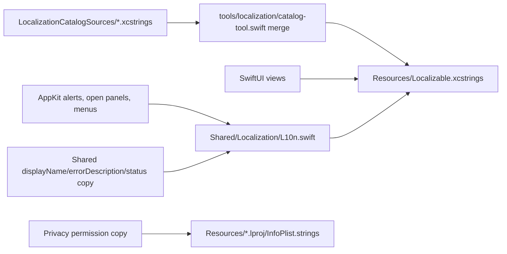

# Localization Architecture

This doc describes how Snapzy localizes user-facing text today. Keep it synced with source, not with intended future work.

## Current State

- Source language: `en`
- Supported app locales: `en`, `vi`, `zh-Hans`, `zh-Hant`, `es`, `ja`, `ko`, `ru`, `fr`, `de`
- Language selection: native macOS app language selection. Snapzy does not ship a custom language picker.
- Source-of-truth catalogs: split by domain under `LocalizationCatalogSources/*.xcstrings`
- Runtime catalog: generated `Snapzy/Resources/Localizable.xcstrings`
- Coverage: menu bar, onboarding, preferences, capture flows, recording flows, Quick Access, Annotate, Video Editor, cloud dialogs, alerts, toasts, and scrolling capture HUD/status text

## Runtime Model



## File Map

| Path | Owns |
| --- | --- |
| `LocalizationCatalogSources/*.xcstrings` | Domain-owned source String Catalog fragments |
| `LocalizationCatalogSources/manifest.json` | Prefix ownership and split/merge layout |
| `tools/localization/catalog-tool.swift` | Audit, split, merge, and verify workflow for catalogs |
| `Snapzy/Shared/Localization/L10n.swift` | Shared localization bridge for AppKit strings, alerts, toasts, `displayName`, `errorDescription`, and text that does not auto-extract cleanly from SwiftUI |
| `Snapzy/Resources/Localizable.xcstrings` | Generated runtime String Catalog shipped in the app bundle |
| `Snapzy/Resources/*.lproj/InfoPlist.strings` | Privacy usage descriptions per locale |
| `Snapzy.xcodeproj/project.pbxproj` | Project regions and String Catalog related build settings |

## Working Rules

- Localize all user-facing copy.
- Edit the domain fragment in `LocalizationCatalogSources/` first when possible.
- Treat `Snapzy/Resources/Localizable.xcstrings` as generated output, not the long-term source of truth.
- Prefer `L10n` for AppKit, service-layer errors, toasts, open-panel prompts, and shared model labels.
- Keep raw ids and persisted values stable. Localize at the display layer, not in storage models.
- Use `Text(verbatim:)` or other explicit verbatim rendering for tokens that should stay raw.
- If Xcode auto-updates `Snapzy/Resources/Localizable.xcstrings`, run `split` first, then `merge`, so the source fragments catch up.
- Keep these intentionally unlocalized unless product behavior changes:
  - Brand names like `Snapzy`
  - File formats such as `PNG`, `JPEG`, `WebP`, `MOV`, `MP4`
  - Keyboard glyphs and shortcut key labels
  - MIME types, UTType ids, URL fragments, and file-name templates
- If a short technical token stays verbatim in UI, add localized accessibility text when needed.

## Workflow

```bash
# Edit source fragments, then regenerate runtime catalog
swift -module-cache-path build/swift-module-cache tools/localization/catalog-tool.swift merge

# If runtime catalog changed first, redistribute into fragments, then normalize
swift -module-cache-path build/swift-module-cache tools/localization/catalog-tool.swift split
swift -module-cache-path build/swift-module-cache tools/localization/catalog-tool.swift merge
```

## Coverage Notes

- Capture and recording flows route their user-facing status, toast, and alert copy through `L10n`.
- Scrolling capture uses localized HUD labels, guidance copy, preview captions, and toast messages.
- Annotate and Video Editor surfaces are localized, including shared tool labels, dialogs, export messaging, and empty states.
- Preferences, onboarding, Quick Access, menu bar, and cloud flows are localized.
- Privacy permission prompts come from `InfoPlist.strings`, not from `Localizable.xcstrings`.

## Verification

- Drift check between `L10n*.swift` and the generated catalog should stay `missing=0` and `extra=0`.
- Verify split / merge integrity with:

```bash
swift -module-cache-path build/swift-module-cache tools/localization/catalog-tool.swift verify
```

- Build with:

```bash
xcodebuild -project Snapzy.xcodeproj -scheme Snapzy -configuration Debug -derivedDataPath /tmp/SnapzyDerivedData build CODE_SIGNING_ALLOWED=NO
```

- Hardcoded user-facing copy check should come back empty for app code outside previews/tests.

## Unresolved Questions

- None right now.
