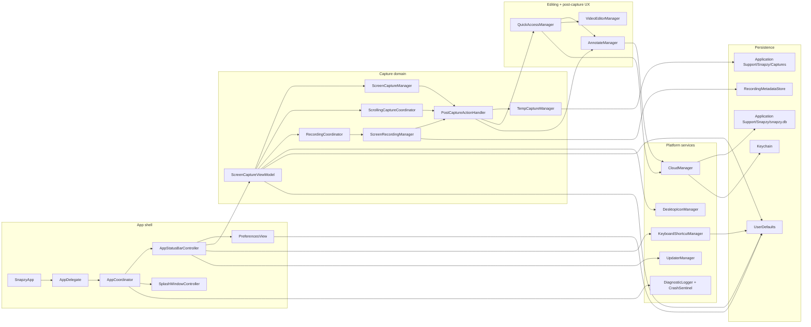

# Project Structure & Runtime Architecture

This doc mirrors the current Snapzy codebase and runtime ownership. Keep it in sync with source, not with intended architecture.

## Runtime Map



## Source Tree

```text
tools/
  localization/
    CatalogTool.swift

Snapzy/
  App/
    SnapzyApp.swift
    AppCoordinator.swift
    AppEnvironment.swift
    AppStatusBarController.swift

  Features/
    Annotate/
    Capture/
    CrashReport/
    Onboarding/
    Preferences/
    QuickAccess/
    Recording/
    Shortcuts/
    Splash/
    Updates/
    VideoEditor/

  Services/
    AppIdentity/
    Appearance/
    Capture/
      ScrollingCapture/
    Clipboard/
    Cloud/
    Diagnostics/
    FileAccess/
    Media/
    Shortcuts/
    Updates/
    Wallpaper/

  Shared/
    Components/
    Extensions/
    Localization/
    Services/
    Styles/

  Common/
    Components/

  Config/
  Resources/
    Localization/
      Shared/
        *.xcstrings
      Features/
        *.xcstrings
      Generated/
      manifest.json
    *.lproj/
```

## Feature Roots

| Path | Owns |
| --- | --- |
| `App/` | Entry point, app lifecycle, menu bar bootstrap, preferences wiring |
| `Features/Splash/` | Splash window, onboarding root coordinator, intro flow, multilingual welcome screen |
| `Features/Onboarding/` | Onboarding step views and visual system, including first-run language selection |
| `Features/Capture/` | High-level screenshot, OCR, cutout, scrolling-capture, and recording entry actions |
| `Features/Recording/` | Recording toolbar, overlays, live annotation, stop/GIF handoff |
| `Features/QuickAccess/` | Floating post-capture stack, temp-file persistence UX, drag-to-app |
| `Features/Annotate/` | Image editor, export, crop, blur, mockup, cutout-aware editing |
| `Features/VideoEditor/` | Trim, zoom, background, Smart Camera, GIF/video export |
| `Features/Preferences/` | General, Capture, Quick Access, Shortcuts, Permissions, Cloud, About tabs |
| `Features/Shortcuts/` | Keyboard shortcut cheat-sheet overlay |
| `Features/Updates/` | Sparkle menu binding and update UI bridge |
| `Features/CrashReport/` | Crash report prompt and diagnostics UX |

## Service Roots

| Path | Owns |
| --- | --- |
| `Services/Capture/` | ScreenCaptureKit capture engine, recording engine, temp storage, post-capture routing |
| `Services/Capture/ScrollingCapture/` | Long screenshot session model, live preview, stitcher, HUD, metrics |
| `Services/Cloud/` | S3/R2 providers, upload orchestration, GRDB history, Keychain credentials, encrypted transfer |
| `Services/FileAccess/` | Sandbox-scoped save-folder permissions and bookmarks |
| `Services/Media/` | OCR, foreground cutout, GIF conversion helpers, WebP encode |
| `Services/Shortcuts/` | Global shortcuts, conflict detection, system shortcut checks |
| `Services/Diagnostics/` | Crash sentinel, logs, toasts, cleanup |
| `Services/Updates/` | Sparkle updater bootstrap |
| `Services/Wallpaper/` | Desktop icon and wallpaper helpers used by capture/editor UX |
| `Services/Appearance/` | Theme and appearance mode management |
| `Shared/Localization/` | Shared localization helpers for AppKit, service copy, alerts, toasts, and display labels |

## Persistence Map

```text
~/Library/Application Support/Snapzy/
  Captures/
    <temp screenshot or recording files when Save is OFF>
    RecordingMetadata/
      index.json
      Entries/
        <uuid>.json
  snapzy.db
```

| Store | Used for |
| --- | --- |
| `UserDefaults` | Preferences, shortcut configs, onboarding flags, feature toggles |
| `Keychain` | Cloud access key, secret key, optional cloud protection password |
| `Application Support/Snapzy/Captures/` | Temp captures and recording metadata sidecars |
| `Application Support/Snapzy/snapzy.db` | Cloud upload history via GRDB |

## Implementation Notes That Matter

- `ScreenCaptureViewModel` is the main entrypoint for capture actions fired from shortcuts or the status bar menu.
- `PostCaptureActionHandler` executes Quick Access, clipboard copy, and screenshot auto-open in Annotate after files already exist.
- `TempCaptureManager` is where the `Save` after-capture toggle becomes real behavior.
- `RecordingCoordinator` owns the toolbar/overlay UX. `ScreenRecordingManager` owns the media pipeline.
- `ScrollingCaptureCoordinator` is its own subsystem. Treat `Services/Capture/ScrollingCapture/*` as a unit.
- `CloudManager` is a facade. Provider-specific behavior lives under `Services/Cloud/`.
- `Shared/Localization/L10n.swift` is the bridge for user-facing copy that does not live directly in SwiftUI view literals.
- `Resources/Localization/Shared/*.xcstrings` and `Resources/Localization/Features/*.xcstrings` are the runtime localization catalogs.
- `tools/localization/CatalogTool.swift` owns audit and verify for split localization catalogs.
- `Resources/*/InfoPlist.strings` still own privacy permission text.
- Keep brand names, file formats, key labels, MIME types, and other technical tokens verbatim unless product behavior explicitly changes.

## Agent Edit Guide

| Task | Start here |
| --- | --- |
| Localization, String Catalog, alert copy, translated display labels | `Resources/Localization/manifest.json`, `tools/localization/CatalogTool.swift`, `Shared/Localization/L10n.swift`, `docs/localization.md` |
| New screenshot mode or capture behavior | `Features/Capture/CaptureViewModel.swift`, `Services/Capture/ScreenCaptureManager.swift`, `docs/capture-flow.md` |
| Scrolling capture UX or stitching | `Services/Capture/ScrollingCapture/` |
| Recording toolbar, overlays, GIF flow | `Features/Recording/`, `Services/Capture/ScreenRecordingManager.swift` |
| Post-capture actions or temp-file logic | `Features/Preferences/PreferencesManager.swift`, `Services/Capture/PostCaptureActionHandler.swift`, `Services/Capture/TempCaptureManager.swift`, `Features/QuickAccess/` |
| Annotate editor | `Features/Annotate/` |
| Video editor or Smart Camera | `Features/VideoEditor/`, `Services/Capture/RecordingMetadata.swift` |
| Cloud upload/config transfer | `Services/Cloud/`, `Features/Preferences/Components/PreferencesCloudSettingsView.swift`, `Features/QuickAccess/Components/QuickAccessCardView.swift`, `Features/Annotate/Components/AnnotateBottomBarView.swift` |
| Onboarding or app startup | `App/`, `Features/Splash/`, `Features/Onboarding/` |
| Shortcuts and conflicts | `Services/Shortcuts/`, `Features/Shortcuts/` |

## Current Behavior Clarifications

- `Upload to Cloud & copy link` in Preferences is a screenshot-only capability toggle. Current implementation exposes upload actions in Quick Access and Annotate; it does not auto-run inside `PostCaptureActionHandler`.
- Quick Access can outlive the original capture location: saved captures stay in the export folder, temp captures are deleted when dismissed unless the user explicitly saves them.
- Annotate and Video Editor both pause Quick Access countdowns for the edited item and resume them when the editor closes.
